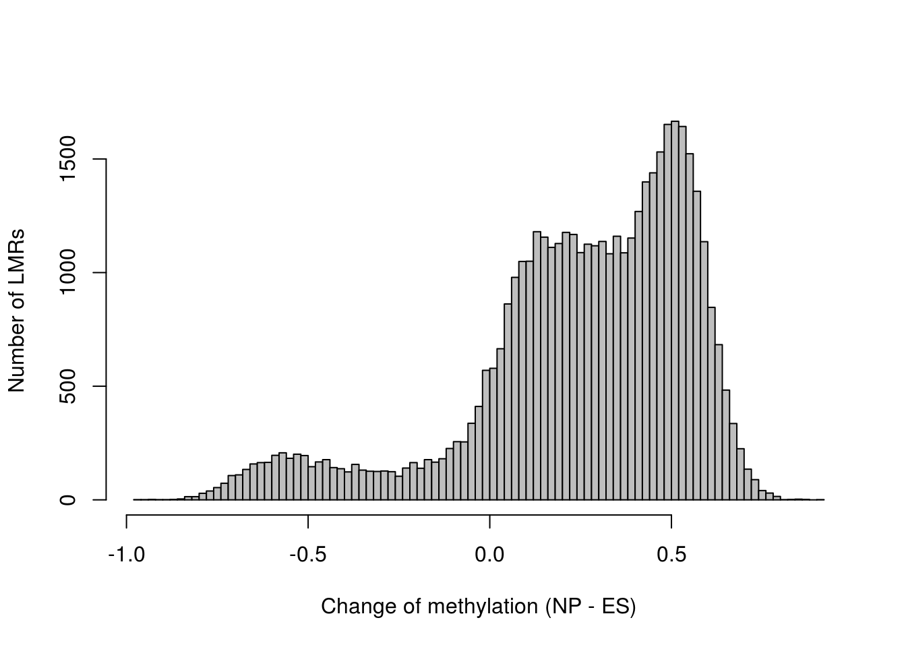
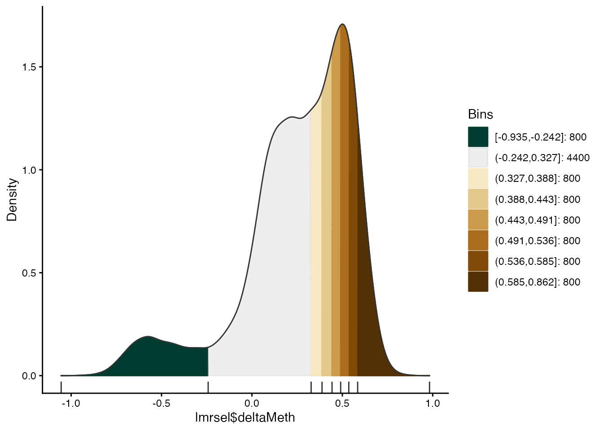
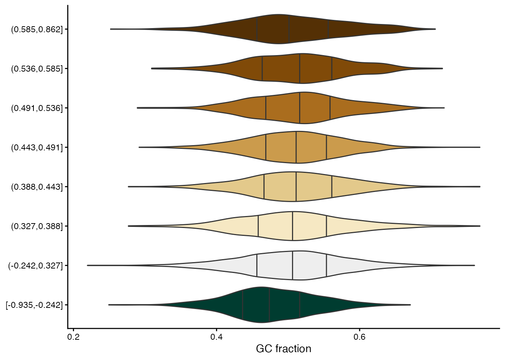
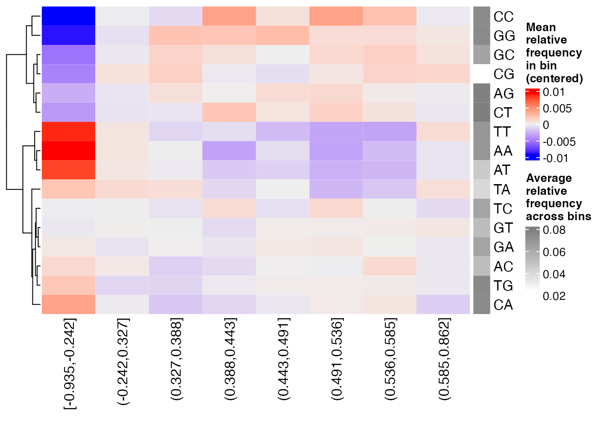
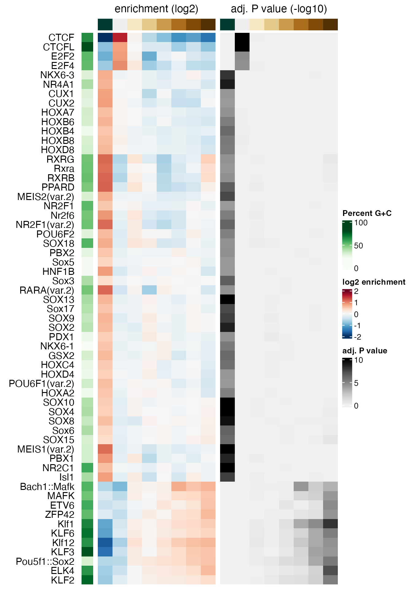
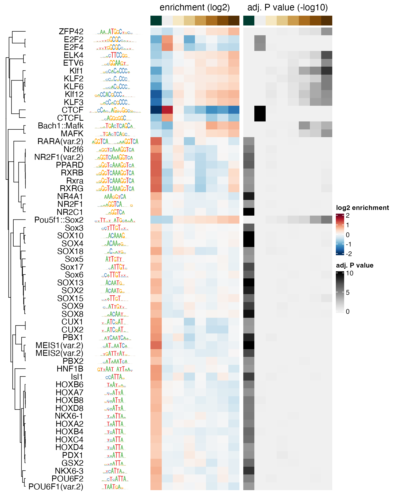
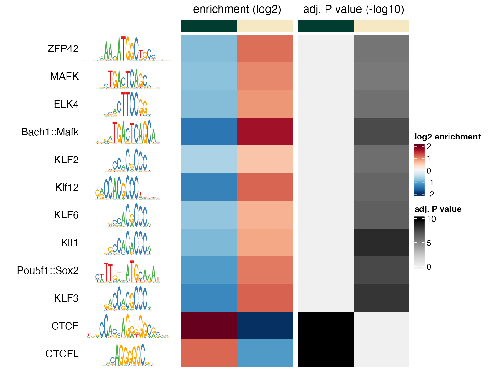
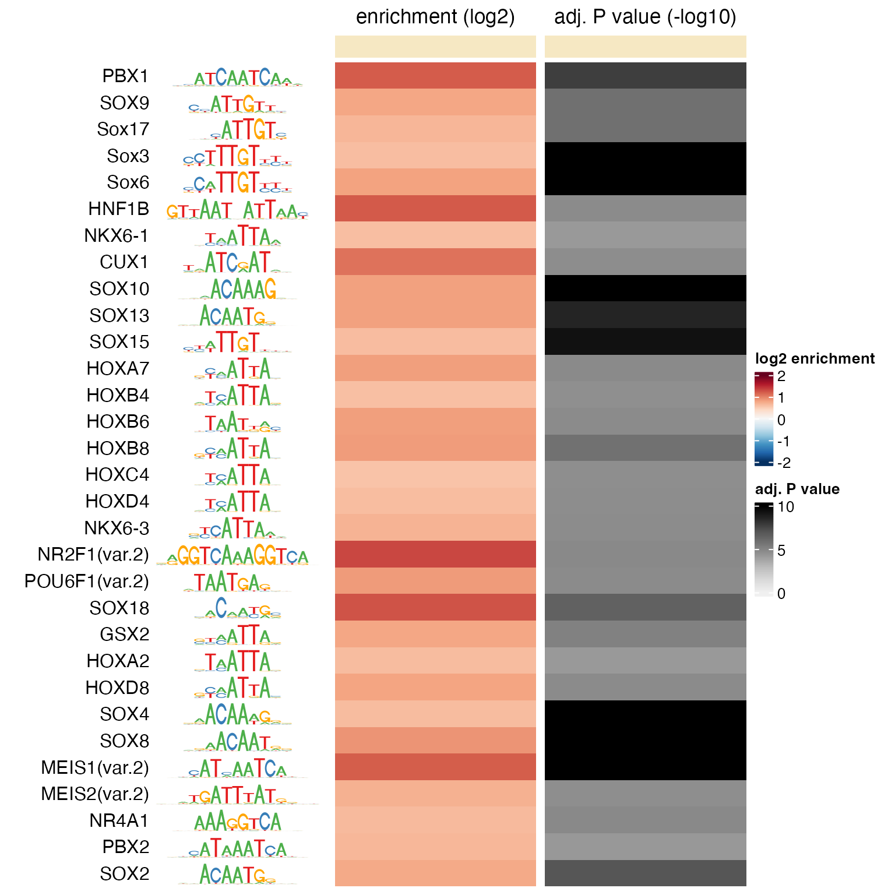
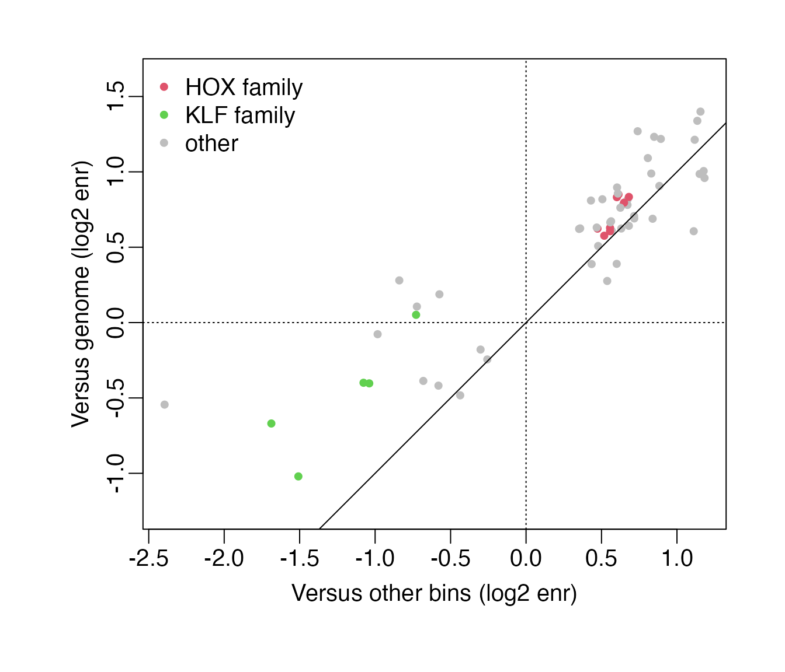
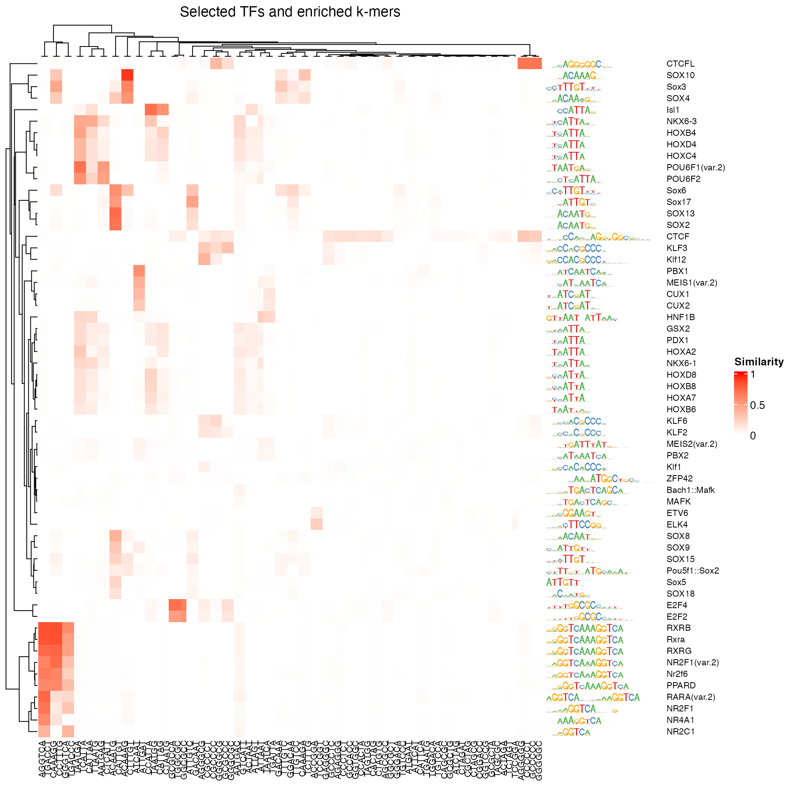

# monaLisa - MOtif aNAlysis with Lisa


## Introduction

*[monaLisa](https://bioconductor.org/packages/3.24/monaLisa)* is a
collection of functions for working with biological sequences and motifs
that represent the binding preferences of transcription factors or
nucleic acid binding proteins.

For example,
*[monaLisa](https://bioconductor.org/packages/3.24/monaLisa)* can be
used to conveniently find motif hits in sequences (see section
@ref(findhits)), or to identify motifs that are likely associated with
observed experimental data. Such analyses are supposed to provide
potential answers to the question “Which transcription factors are the
drivers of my observed changes in
expression/methylation/accessibility?”.

Several other approaches have been described that also address this
problem, among them REDUCE (Roven and Bussemaker 2003), AME (McLeay and
Bailey 2010) and ISMARA (Balwierz et al. 2014). In
*[monaLisa](https://bioconductor.org/packages/3.24/monaLisa)*, we aim to
provide a flexible implementation that integrates well with other
Bioconductor resources, makes use of the sequence composition correction
developed for Homer (Heinz et al. 2010) or stability selection
(Meinshausen and Bühlmann 2010) and provides several alternative ways to
study the relationship between experimental measurements and sequence
motifs.

You can use known motifs from collections of transcription factor
binding specificities such as
*[JASPAR2020](https://bioconductor.org/packages/3.24/JASPAR2020)*, also
available from Bioconductor. Genomic regions could be for example
promoters, enhancers or accessible regions for which experimental data
is available.

Two independent approaches are implemented to identify interesting
motifs:

- In the **binned motif enrichment analysis** (`calcBinnedMotifEnrR`,
  see section @ref(binned)), genomic regions are grouped into bins
  according to a numerical value assigned to each region, such as the
  change in expression, accessibility or methylation. Motif enrichments
  are then calculated for each bin, normalizing for differences in
  sequence composition in a very similar way as originally done by
  [Homer](http://homer.ucsd.edu/homer/index.md) (Heinz et al. 2010). As
  a special case, the approach can also be used to do a simple two set
  comparison (foreground against background sequences, see section
  @ref(binary)) or to determine motif enrichments in a single set of
  sequences compared to a suitably matched genomic background set (see
  section @ref(vsgenome)). The binned motif enrichment approach was
  first introduced in Ginno et al. (2018) and subsequently applied in
  e.g. Barisic et al. (2019). To see more details on how
  `calcBinnedMotifEnrR` resembles `Homer`, check the function help page.
  We recommend using this function to do the binned motif enrichment
  analysis, since it corrects for sequence composition differences
  similarly to `Homer`, but is implemented more efficiently.
  `calcBinnedMotifEnrHomer` implements the same analysis using Homer and
  therefore requires a local [installation of
  Homer](http://homer.ucsd.edu/homer/introduction/install.md), and
  `calcBinnedKmerEnr`(see section @ref(binnedkmers)) implements the
  analysis for k-mers instead of motifs, to study sequence enrichments
  without the requirement of known motifs.

- **Randomized Lasso stability selection** (`randLassoStabSel`, see [the
  stability selection
  vignette](https://bioconductor.org/packages/3.24/monaLisa/vignettes/selecting_motifs_with_randLassoStabSel.html)
  in *[monaLisa](https://bioconductor.org/packages/3.24/monaLisa)*) uses
  a robust regression approach (stability selection, Meinshausen and
  Bühlmann (2010)) to predict what transcription factors can explain
  experimental measurements, for example changes in chromatin
  accessibility between two conditions. Also this approach allows to
  correct for sequence composition. In addition, similar motifs have to
  “compete” with each other to be selected.

For both approaches, functions that allow visualization of obtained
results are provided.

If you prefer to jump right in, you can continue with section
@ref(quick) that shows a quick hypothetical example of how to run a
binned motif enrichment analysis. If you prefer to actually compute
enrichments on real data, you can find below a detailed example for a
binned motif enrichment analysis (section @ref(binned)). The special
cases of analyzing just two sets of sequences (binary motif enrichment
analysis) or a single set of sequences (comparing it to a suitable
background sampled from the genome) are illustrated in section
@ref(nobins).

## Installation

*[monaLisa](https://bioconductor.org/packages/3.24/monaLisa)* can be
installed from Bioconductor via the
*[BiocManager](https://CRAN.R-project.org/package=BiocManager)* package:

``` r

if (!requireNamespace("BiocManager", quietly = TRUE))
    install.packages("BiocManager")

BiocManager::install("monaLisa")
```

## Quick example: Identify enriched motifs in bins

The quick example below, which we do not run, illustrates how a binned
motif enrichment analysis can be performed in
*[monaLisa](https://bioconductor.org/packages/3.24/monaLisa)*. We assume
that you already have a set of peaks. The sequences of the peak regions
are stored in a
[`Biostrings::DNAStringSet`](https://rdrr.io/pkg/Biostrings/man/XStringSet-class.html)
object (`peak_seqs`), and additionally each peak is associated with a
numeric value (e.g., the change of methylation between two conditions,
stored in the `peak_change` vector), that will be used to bin the
regions before finding motifs enriched in each bin.

``` r

# load package
library(monaLisa)

# bin regions
# - peak_change is a numerical vector
# - peak_change needs to be created by the user to run this code
peak_bins <- bin(x = peak_change, binmode = "equalN", nElement = 400)

# calculate motif enrichments
# - peak_seqs is a DNAStringSet, pwms is a PWMatrixList
# - peak_seqs and pwms need to be created by the user to run this code
se <- calcBinnedMotifEnrR(seqs = peak_seqs,
                          bins = peak_bins,
                          pwmL = pwms)
```

The returned `se` is a `SummarizedExperiment` with `assays` *negLog10P*,
*negLog10Padj*, *pearsonResid*, *expForegroundWgt*, *log2enr*,
*sumForegroundWgtWithHits* and *sumBackgroundWgtWithHits*, each
containing a matrix with motifs (rows) by bins (columns). The values
are:

- *negLog10P*: the raw P value ($`-\log_{10} p`$) of a given motif
  enrichment in a given bin. Each P value results from an enrichment
  calculation comparing occurrences of each motif in the bin to its
  occurrences in background sequences, defined by the `background`
  argument (by default: sequences in all other bins).  
- *negLog10Padj*: Same as *negLog10P* but adjusted for multiple testing
  using the method provided in the `p.adjust.method` argument, by
  default: Benjamini and Hochberg, 1995
  (`p.adjust(..., method="fdr")`).  
- *pearsonResid*: Standardized Pearson residuals, a measure of motif
  enrichment akin to a z-score for the number of regions in the bin
  containing the motif. The standardized Pearson residuals are given by
  $`resid = (o - \mu)/\sigma`$, where $`\mu`$ is the expected count and
  $`\sigma`$ the standard deviation of the expression in the numerator,
  under the null hypothesis that the probability of containing a motif
  is independent of whether the sequence is in the foreground or the
  background (see e.g. Agresti (2007), section @ref(runBinned)).
- *expForegroundWgtWithHits*: The expected number of regions in the bin
  containing a given motif.
- *log2enr*: Motif enrichments, calculated as:
  $`log2enr = log2((o + c)/(e + c))`$, where $`o`$ and $`e`$ are the
  observed and expected numbers of regions in the bin containing a given
  motif, respectively, and $`c`$ is a pseudocount defined by the
  `pseudocount.log2enr` argument.  
- *sumForegroundWgtWithHits* and *sumBackgroundWgtWithHits* are the sum
  of foreground and background sequences that have at least one
  occurrence of the motif, respectively. The background sequences are
  weighted in order to adjust for differences in sequence composition
  between foreground and background.

In addition, `rowData(se)` and `colData(se)` give information about the
used motifs and bins, respectively. In `metadata(se)` you can find
information about parameter values.

## Binned motif enrichment analysis with multiple sets of sequences (more than two): Finding TFs enriched in differentially methylated regions

This section illustrates the use of
*[monaLisa](https://bioconductor.org/packages/3.24/monaLisa)* to analyze
regions or sequences with associated numerical values (here: changes of
DNA methylation), grouped into several bins according to these values.
The special cases of just two sets of sequences (binary motif enrichment
analysis) or a single set of sequences (comparing it to a suitable
background sampled from the genome) are illustrated in section
@ref(nobins).

This example is based on experimental data from an *in vitro*
differentiation system, in which mouse embryonic stem (ES) cells are
differentiated into neuronal progenitors (NP). In an earlier study
(Stadler et al. 2011), we have analyzed the genome-wide CpG methylation
patterns in these cell types and identified so called *low methylated
regions* (LMRs), that have reduced methylation levels and correspond to
regions bound by transcription factors.

We also developed a tool that systematically identifies such regions
from genome-wide methylation data (Burger et al. 2013). Interestingly, a
change in methylation of LMRs is indicative of altered transcription
factor binding. We will therefore use these regions to identify
transcription factor motifs that are enriched or depleted in LMRs that
change their methylation between ES and NP cell states.

### Load packages

We start by loading the needed packages:

``` r

library(GenomicRanges)
library(SummarizedExperiment)
library(JASPAR2020)
library(TFBSTools)
library(BSgenome.Mmusculus.UCSC.mm10)
library(monaLisa)
library(ComplexHeatmap)
library(circlize)
```

### Genomic regions or sequences of interest

*[monaLisa](https://bioconductor.org/packages/3.24/monaLisa)* provides a
file with genomic coordinates (mouse mm10 assembly) of LMRs, with the
respective changes of methylation. We load this `GRanges` object into
`R`.

``` r

lmrfile <- system.file("extdata", "LMRsESNPmerged.gr.rds", 
                       package = "monaLisa")
lmr <- readRDS(lmrfile)
lmr
#> GRanges object with 45414 ranges and 1 metadata column:
#>           seqnames          ranges strand |    deltaMeth
#>              <Rle>       <IRanges>  <Rle> |    <numeric>
#>       [1]     chr1 3549153-3550201      * |    0.3190299
#>       [2]     chr1 3680914-3682164      * |    0.0657352
#>       [3]     chr1 3913315-3914523      * |    0.4803313
#>       [4]     chr1 3953500-3954157      * |    0.4504727
#>       [5]     chr1 4150457-4151567      * |    0.5014768
#>       ...      ...             ...    ... .          ...
#>   [45410]     chrY 4196254-4196510      * | -0.020020382
#>   [45411]     chrY 4193654-4194152      * | -0.102559935
#>   [45412]     chrY 4190208-4192766      * | -0.031668206
#>   [45413]     chrY 4188072-4188924      * |  0.130623049
#>   [45414]     chrY 4181867-4182624      * |  0.000494588
#>   -------
#>   seqinfo: 21 sequences from an unspecified genome
```

Alternatively, the user may also start the analysis with genomic regions
contained in a `bed` file, or directly with sequences in a `FASTA` file.
The following example code illustrates how to do this, but should not be
run if you are following the examples in this vignette.

``` r

# starting from a bed file
#   import as `GRanges` using `rtracklayer::import`
#   remark: if the bed file also contains scores (5th column), these will be
#           also be imported and available in the "score" metadata column,
#           in this example in `lmr$score`
lmr <- rtracklayer::import(con = "file.bed", format = "bed")

# starting from sequences in a FASTA file
#   import as `DNAStringSet` using `Biostrings::readDNAStringSet`
#   remark: contrary to the coordinates in a `GRanges` object like `lmr` above,
#           the sequences in `lmrseqs` can be directly used as input to
#           monaLisa::calcBinnedMotifEnrR (no need to extract sequences from
#           the genome, just skip that step below)
lmrseqs <- Biostrings::readDNAStringSet(filepath = "myfile.fa", format = "fasta")
```

We can see there are 45414 LMRs, most of which gain methylation between
ES and NP stages:

``` r

hist(lmr$deltaMeth, 100, col = "gray", main = "",
     xlab = "Change of methylation (NP - ES)", ylab = "Number of LMRs")
```



In order to keep the computation time reasonable, we’ll select 10,000 of
the LMRs randomly:

``` r

set.seed(1)
lmrsel <- lmr[ sample(x = length(lmr), size = 10000, replace = FALSE) ]
```

### Bin genomic regions

Now let’s bin our LMRs by how much they change methylation, using the
`bin` function from
*[monaLisa](https://bioconductor.org/packages/3.24/monaLisa)*. We are
not interested in small changes of methylation, say less than 0.3, so
we’ll use the `minAbsX` argument to create a *no-change* bin in \[-0.3,
0.3). The remaining LMRs are put into bins of 800 each:

``` r

bins <- bin(x = lmrsel$deltaMeth, binmode = "equalN", nElement = 800, 
            minAbsX = 0.3)
table(bins)
#> bins
#> [-0.935,-0.242]  (-0.242,0.327]   (0.327,0.388]   (0.388,0.443]   (0.443,0.491] 
#>             800            4400             800             800             800 
#>   (0.491,0.536]   (0.536,0.585]   (0.585,0.862] 
#>             800             800             800
```

Generally speaking, we recommend a minimum of ~100 sequences per bin as
fewer sequences may lead to small motif counts and thus either small or
unstable enrichments.

We can see which bin has been set to be the zero bin using `getZeroBin`,
or set it to a different bin using `setZeroBin`:

``` r

# find the index of the level representing the zero bin 
levels(bins)
#> [1] "[-0.935,-0.242]" "(-0.242,0.327]"  "(0.327,0.388]"   "(0.388,0.443]"  
#> [5] "(0.443,0.491]"   "(0.491,0.536]"   "(0.536,0.585]"   "(0.585,0.862]"
getZeroBin(bins)
#> [1] 2
```

Because of the asymmetry of methylation changes, there is only a single
bin with LMRs that lost methylation and many that gained:

``` r

plotBinDensity(lmrsel$deltaMeth, bins)
```



Note that the bin breaks around the *no-change* bin are not exactly -0.3
to 0.3. They have been adjusted to have the required 800 LMRs per bin
below and above it.
*[monaLisa](https://bioconductor.org/packages/3.24/monaLisa)* will give
a warning if the adjusted bin breaks are strongly deviating from the
requested `minAbsX` value, and `bin(..., model = "breaks")` can be used
in cases where exactly defined bin boundaries are required.

### Prepare motif enrichment analysis

Next we prepare the motif enrichment analysis. We first need known
motifs representing transcription factor binding site preferences. We
extract all vertebrate motifs from the
*[JASPAR2020](https://bioconductor.org/packages/3.24/JASPAR2020)*
package as positional weight matrices (PWMs):

``` r

pwms <- getMatrixSet(JASPAR2020,
                     opts = list(matrixtype = "PWM",
                                 tax_group = "vertebrates"))
```

Furthermore, we need the sequences corresponding to our LMRs. As
sequences in one bin are compared to the sequences in other bins, we
would not want differences of sequence lengths or composition between
bins that might bias our motif enrichment results.

In general, we would recommend to use regions of similar or even equal
lengths to avoid a length bias, for example by using a fixed-size region
around the midpoint of each region of interest using
[`GenomicRanges::resize`](https://rdrr.io/pkg/IRanges/man/intra-range-methods.html).
In addition, the resized regions may have to be constrained to the
chromosome boundaries using trim:

``` r

summary(width(lmrsel))
#>    Min. 1st Qu.  Median    Mean 3rd Qu.    Max. 
#>     9.0   213.0   401.0   512.9   676.0  5973.0
lmrsel <- trim(resize(lmrsel, width = median(width(lmrsel)), fix = "center"))
summary(width(lmrsel))
#>    Min. 1st Qu.  Median    Mean 3rd Qu.    Max. 
#>     401     401     401     401     401     401
```

We can now directly extract the corresponding sequences from the
*[BSgenome.Mmusculus.UCSC.mm10](https://bioconductor.org/packages/3.24/BSgenome.Mmusculus.UCSC.mm10)*
package (assuming you have started the analysis with genomic regions -
if you already have sequences, just skip this step)

``` r

lmrseqs <- getSeq(BSgenome.Mmusculus.UCSC.mm10, lmrsel)
```

and check for differences in sequence composition between bins using the
`plotBinDiagnostics` function. “GCfrac” will plot the distributions of
the fraction of G+C bases, and “dinucfreq” creates a heatmap of average
di-nucleotide frequencies in each bin, relative to the overall average.

``` r

plotBinDiagnostics(seqs = lmrseqs, bins = bins, aspect = "GCfrac")
```



``` r

plotBinDiagnostics(seqs = lmrseqs, bins = bins, aspect = "dinucfreq")
```



From these plots, we can see that LMRs with lower methylation in NP
cells compared to ES cells (bin \[-0.935,-0.242\]) tend to be GC-poorer
than LMRs in other bins. A strong bias of this kind could give rise to
false positives in that bin, e.g. enrichments of AT-rich motifs.

At this point in the analysis, it is difficult to decide if this bias
should be addressed here (for example by subsampling sequences of more
comparable GC composition), or if the bias can be ignored because the
built-in sequence composition correction in `calcBinnedMotifEnrR` will
be able to account for it. Our recommendation would be to take a mental
note at this point and remember that sequences in the \[-0.935,-0.242\]
bin tend to be GC-poorer. Later, we should check if AT-rich motifs are
specifically enriched in that bin, and if that is the case, we should
critically assess if that result is robust and can be reproduced in an
analysis that uses more balanced sequences in all bins, or an analysis
with `background = "genome"`. The `show_motif_GC` and `show_seqlogo`
arguments of `plotMotifHeatmaps` can help to visually identify motif
sequence composition in an enrichment result (see below).

### Run motif enrichment analysis

Finally, we run the binned motif enrichment analysis.

This step will take a while, and typically you would use the `BPPARAM`
argument to run it with parallelization using `n` cores as follows:
`calcBinnedMotifEnrR(..., BPPARAM = BiocParallel::MulticoreParam(n)))`.
For this example however, you can skip over the next step and just load
the pre-computed results as shown further below.

``` r

se <- calcBinnedMotifEnrR(seqs = lmrseqs, bins = bins, pwmL = pwms)
```

In case you did not run the above code, let’s now read in the results:

``` r

se <- readRDS(system.file("extdata", "results.binned_motif_enrichment_LMRs.rds",
                          package = "monaLisa"))
```

`se` is a `SummarizedExperiment` object which nicely keeps motifs, bins
and corresponding metadata together:

``` r

# summary
se
#> class: SummarizedExperiment 
#> dim: 746 8 
#> metadata(5): bins bins.binmode bins.breaks bins.bin0 param
#> assays(7): negLog10P negLog10Padj ... sumForegroundWgtWithHits
#>   sumBackgroundWgtWithHits
#> rownames(746): MA0004.1 MA0006.1 ... MA0528.2 MA0609.2
#> rowData names(5): motif.id motif.name motif.pfm motif.pwm
#>   motif.percentGC
#> colnames(8): [-0.935,-0.242] (-0.242,0.327] ... (0.536,0.585]
#>   (0.585,0.862]
#> colData names(6): bin.names bin.lower ... totalWgtForeground
#>   totalWgtBackground
dim(se) # motifs-by-bins
#> [1] 746   8

# motif info
rowData(se)
#> DataFrame with 746 rows and 5 columns
#>             motif.id   motif.name                       motif.pfm
#>          <character>  <character>                  <PFMatrixList>
#> MA0004.1    MA0004.1         Arnt         MA0004.1; Arnt; Unknown
#> MA0006.1    MA0006.1    Ahr::Arnt    MA0006.1; Ahr::Arnt; Unknown
#> MA0019.1    MA0019.1 Ddit3::Cebpa MA0019.1; Ddit3::Cebpa; Unknown
#> MA0029.1    MA0029.1        Mecom        MA0029.1; Mecom; Unknown
#> MA0030.1    MA0030.1        FOXF2        MA0030.1; FOXF2; Unknown
#> ...              ...          ...                             ...
#> MA0093.3    MA0093.3         USF1         MA0093.3; USF1; Unknown
#> MA0526.3    MA0526.3         USF2         MA0526.3; USF2; Unknown
#> MA0748.2    MA0748.2          YY2          MA0748.2; YY2; Unknown
#> MA0528.2    MA0528.2       ZNF263       MA0528.2; ZNF263; Unknown
#> MA0609.2    MA0609.2         CREM         MA0609.2; CREM; Unknown
#>                                                            motif.pwm
#>                                                       <PWMatrixList>
#> MA0004.1       MA0004.1; Arnt; Basic helix-loop-helix factors (bHLH)
#> MA0006.1  MA0006.1; Ahr::Arnt; Basic helix-loop-helix factors (bHLH)
#> MA0019.1 MA0019.1; Ddit3::Cebpa; Basic leucine zipper factors (bZIP)
#> MA0029.1                   MA0029.1; Mecom; C2H2 zinc finger factors
#> MA0030.1           MA0030.1; FOXF2; Fork head / winged helix factors
#> ...                                                              ...
#> MA0093.3       MA0093.3; USF1; Basic helix-loop-helix factors (bHLH)
#> MA0526.3       MA0526.3; USF2; Basic helix-loop-helix factors (bHLH)
#> MA0748.2                     MA0748.2; YY2; C2H2 zinc finger factors
#> MA0528.2                  MA0528.2; ZNF263; C2H2 zinc finger factors
#> MA0609.2         MA0609.2; CREM; Basic leucine zipper factors (bZIP)
#>          motif.percentGC
#>                <numeric>
#> MA0004.1         64.0893
#> MA0006.1         71.5266
#> MA0019.1         48.3898
#> MA0029.1         28.0907
#> MA0030.1         34.2125
#> ...                  ...
#> MA0093.3         51.0234
#> MA0526.3         51.4931
#> MA0748.2         67.2542
#> MA0528.2         67.4339
#> MA0609.2         53.2402
head(rownames(se))
#> [1] "MA0004.1" "MA0006.1" "MA0019.1" "MA0029.1" "MA0030.1" "MA0031.1"

# bin info
colData(se)
#> DataFrame with 8 rows and 6 columns
#>                       bin.names bin.lower bin.upper bin.nochange
#>                     <character> <numeric> <numeric>    <logical>
#> [-0.935,-0.242] [-0.935,-0.242] -0.935484 -0.242127        FALSE
#> (-0.242,0.327]   (-0.242,0.327] -0.242127  0.327369         TRUE
#> (0.327,0.388]     (0.327,0.388]  0.327369  0.387698        FALSE
#> (0.388,0.443]     (0.388,0.443]  0.387698  0.443079        FALSE
#> (0.443,0.491]     (0.443,0.491]  0.443079  0.490691        FALSE
#> (0.491,0.536]     (0.491,0.536]  0.490691  0.535714        FALSE
#> (0.536,0.585]     (0.536,0.585]  0.535714  0.584707        FALSE
#> (0.585,0.862]     (0.585,0.862]  0.584707  0.862443        FALSE
#>                 totalWgtForeground totalWgtBackground
#>                          <numeric>          <numeric>
#> [-0.935,-0.242]                800            8628.40
#> (-0.242,0.327]                4400            5576.92
#> (0.327,0.388]                  800            9186.26
#> (0.388,0.443]                  800            9186.58
#> (0.443,0.491]                  800            9195.14
#> (0.491,0.536]                  800            9157.61
#> (0.536,0.585]                  800            9163.05
#> (0.585,0.862]                  800            9137.44
head(colnames(se))
#> [1] "[-0.935,-0.242]" "(-0.242,0.327]"  "(0.327,0.388]"   "(0.388,0.443]"  
#> [5] "(0.443,0.491]"   "(0.491,0.536]"

# assays: the motif enrichment results
assayNames(se)
#> [1] "negLog10P"                "negLog10Padj"            
#> [3] "pearsonResid"             "expForegroundWgtWithHits"
#> [5] "log2enr"                  "sumForegroundWgtWithHits"
#> [7] "sumBackgroundWgtWithHits"
assay(se, "log2enr")[1:5, 1:3]
#>          [-0.935,-0.242] (-0.242,0.327] (0.327,0.388]
#> MA0004.1      -0.4332719    -0.16418567   0.047435758
#> MA0006.1       0.2407477    -0.11995829  -0.005914484
#> MA0019.1      -0.6736372     0.26842621   0.030973190
#> MA0029.1      -0.1475501    -0.12750322   0.088480526
#> MA0030.1      -0.4021844     0.06710565   0.152049687
```

We can plot the results using the `plotMotifHeatmaps` function,
e.g. selecting all transcription factor motifs that have a
$`-log_{10} FDR`$ of at least 4.0 in any bin (corresponding to an
$`FDR < 10^{-4}`$). FDR values are stored in the `negLog10Padj` assay:

``` r

# select strongly enriched motifs
sel <- apply(assay(se, "negLog10Padj"), 1, 
             function(x) max(abs(x), 0, na.rm = TRUE)) > 4.0
sum(sel)
#> [1] 59
seSel <- se[sel, ]

# plot
plotMotifHeatmaps(x = seSel, which.plots = c("log2enr", "negLog10Padj"), 
                  width = 2.0, cluster = TRUE, maxEnr = 2, maxSig = 10, 
                  show_motif_GC = TRUE)
```



In order to select only motifs with significant enrichments in a
specific bin, or in any bin except the “zero” bin, you could use:

``` r

# significantly enriched in bin 8
levels(bins)[8]
#> [1] "(0.585,0.862]"
sel.bin8 <- assay(se, "negLog10Padj")[, 8] > 4.0
sum(sel.bin8, na.rm = TRUE)
#> [1] 10

# significantly enriched in any "non-zero" bin
getZeroBin(bins)
#> [1] 2
sel.nonZero <- apply(
    assay(se, "negLog10Padj")[, -getZeroBin(bins), drop = FALSE], 1,
    function(x) max(abs(x), 0, na.rm = TRUE)) > 4.0
sum(sel.nonZero)
#> [1] 55
```

Setting `cluster = TRUE` in `plotMotifHeatmaps` has re-ordered the rows
using hierarchical clustering of the `pearsonResid` assay. As many
transcription factor binding motifs are similar to each other, it is
also helpful to show the enrichment heatmap clustered by motif
similarity. To this end, we first calculate all pairwise motif
similarities (measured as the maximum Pearson correlation of all
possible shifted alignments). This can be quickly calculated for the few
selected motifs using the `motifSimilarity` function. For many motifs,
this step may take a while, and it may be useful to parallelize it using
the `BPPARAM` argument (e.g. to run on `n` parallel threads using the
multi-core backend, you can use:
`motifSimilarity(..., BPPARAM = BiocParallel::MulticoreParam(n))`).

``` r

SimMatSel <- motifSimilarity(rowData(seSel)$motif.pfm)
range(SimMatSel)
#> [1] 0.05339967 1.00000000
```

The order of the TFs in the resulting matrix is consistent with the
elements of `seSel`, and the maximal similarity between any pair of
motifs is 1.0. By subtracting these similarities from 1.0, we obtain
distances that we use to perform a hierarchical clustering with the
[`stats::hclust`](https://rdrr.io/r/stats/hclust.html) function. The
returned object (`hcl`) is then passed to the `cluster` argument of
`plotMotifHeatmaps` to define the order of the rows in the heatmap. The
plotting of the dendrogram is controlled by the argument
`show_dendrogram`, and we also display the motifs as sequence logos
using `show_seqlogo`:

``` r

# create hclust object, similarity defined by 1 - Pearson correlation
hcl <- hclust(as.dist(1 - SimMatSel), method = "average")
plotMotifHeatmaps(x = seSel, which.plots = c("log2enr", "negLog10Padj"), 
                  width = 1.8, cluster = hcl, maxEnr = 2, maxSig = 10,
                  show_dendrogram = TRUE, show_seqlogo = TRUE,
                  width.seqlogo = 1.2)
```



We have seen above that sequences in the \[-0.935,-0.242\] bin (first
column from the left in the heatmap) were GC-poorer than the sequences
in other bins. While some of the enriched motifs in that bin are not
GC-poor (for example RARA, NR2F1 and similar motifs), other more weakly
enriched motifs are clearly AT-rich (for example HOX family motifs). To
verify that these are not false positive results, the motif analysis
should be repeated after sequences have been subsampled in each bin to
have similar GC composition in all bins, or with
`calcBinnedMotifEnrR(..., background = "genome")`. The latter is
illustrated in section @ref(vsgenome).

### Convert between motif text file for `Homer` and motif objects in `R`

*[monaLisa](https://bioconductor.org/packages/3.24/monaLisa)* provides
two functions for performing binned motif enrichment analysis
(`calcBinnedMotifEnrR` and `calcBinnedMotifEnrHomer`).
`calcBinnedMotifEnrR` implements the binned motif enrichment analysis in
`R`, similarly to `Homer`, and does not require the user to have the
`Homer` tool pre-installed. For more information on that function and
how it resembles the `Homer` tool see the function documentation.

A simple way to represent a DNA sequence motif that assumes independence
of positions in the motif is a matrix with four rows (for the bases A,
C, G and T) and `n` columns for the `n` positions in the motif. The
values in that matrix can represent the sequence preferences of a
binding protein in several different ways:

- **Position frequency matrices (PFM)** contain values that correspond
  to the number of times (frequency) that a given base has been observed
  in at a given position of the motif. It is usually obtained from a set
  of known, aligned binding site sequences, and depending on the number
  of sequences, the values will be lower or higher. In `R`, PFMs are
  often represented using
  [`TFBSTools::PFMatrix`](https://rdrr.io/pkg/TFBSTools/man/XMatrix-class.html)
  (single motif) or
  [`TFBSTools::PFMatrixList`](https://rdrr.io/pkg/TFBSTools/man/XMatrixList-class.html)
  (set of motifs) objects. This is the rawest way to represent a
  sequence motif and can be converted into any other representation.
- **Position probability matrices (PPM)** are obtained by dividing the
  counts in each column of a PFM by their sum. The values now give a
  probability of observing a given base at that position of the motif
  and sum up to one in each column. This is the representation used in
  motif text files for `Homer`. A PPM can only be converted back to a
  PFM by knowing or assuming how many binding site sequences were
  observed (see argument `n` in `homerToPFMatrixList`).  
- **Position weight matrices (PWM)** (also known as position specific
  scoring matrices, PSSM) are obtained by comparing the base
  probabilities in a PPM to the probabilities of observing each base
  outside of a binding site (background base probabilities), for example
  by calculating log-odds scores (see
  [`TFBSTools::toPWM`](https://rdrr.io/pkg/TFBSTools/man/toPWM-methods.html)
  for details). This is a useful representation for scanning sequences
  for motif matches. In `R`, PWMs are often represented using
  [`TFBSTools::PWMatrix`](https://rdrr.io/pkg/TFBSTools/man/XMatrix-class.html)
  (single motif) or
  [`TFBSTools::PWMatrixList`](https://rdrr.io/pkg/TFBSTools/man/XMatrixList-class.html)
  (set of motifs).

`calcBinnedMotifEnrR` takes PWMs as a
[`TFBSTools::PWMatrixList`](https://rdrr.io/pkg/TFBSTools/man/XMatrixList-class.html)
object to scan for motif hits. `calcBinnedMotifEnrHomer` on the other
hand takes a motif text file with PPMs, and requires the user to have
`Homer` installed to use it for the binned motif enrichment analysis.
Here, we show how one can get motif PFMs from
*[JASPAR2020](https://bioconductor.org/packages/3.24/JASPAR2020)* and
convert them to a `Homer`-compatible text file with PPMs (`dumpJaspar`)
and vice versa (`homerToPFMatrixList`), and how to convert a
[`TFBSTools::PFMatrixList`](https://rdrr.io/pkg/TFBSTools/man/XMatrixList-class.html)
to a
[`TFBSTools::PWMatrixList`](https://rdrr.io/pkg/TFBSTools/man/XMatrixList-class.html)
for use with `calcBinnedMotifEnrR` or `findMotifHits`:

``` r

# get PFMs from JASPAR2020 package (vertebrate subset)
pfms <- getMatrixSet(JASPAR2020,
                     opts = list(matrixtype = "PFM",
                                 tax_group = "vertebrates"))

# convert PFMs to PWMs
pwms <- toPWM(pfms)

# convert JASPAR2020 PFMs (vertebrate subset) to Homer motif file
tmp <- tempfile()
convert <- dumpJaspar(filename = tmp,
                      pkg = "JASPAR2020",
                      pseudocount = 0,
                      opts = list(tax_group = "vertebrates"))

# convert Homer motif file to PFMatrixList
pfms_ret <- homerToPFMatrixList(filename = tmp, n = 100L)

# compare the first PFM
# - notice the different magnitude of counts (controlled by `n`)
# - notice that with the default (recommended) value of `pseudocount = 1.0`,
#   there would be no zero values in pfms_ret matrices, making
#   pfms and pfms_ret even more different
as.matrix(pfms[[1]])
#>   [,1] [,2] [,3] [,4] [,5] [,6]
#> A    4   19    0    0    0    0
#> C   16    0   20    0    0    0
#> G    0    1    0   20    0   20
#> T    0    0    0    0   20    0
as.matrix(pfms_ret[[1]])
#>   [,1] [,2] [,3] [,4] [,5] [,6]
#> A   20   95    0    0    0    0
#> C   80    0  100    0    0    0
#> G    0    5    0  100    0  100
#> T    0    0    0    0  100    0

# compare position probability matrices with the original PFM 
round(sweep(x = as.matrix(pfms[[1]]), MARGIN = 2, 
            STATS = colSums(as.matrix(pfms[[1]])), FUN = "/"), 3)
#>   [,1] [,2] [,3] [,4] [,5] [,6]
#> A  0.2 0.95    0    0    0    0
#> C  0.8 0.00    1    0    0    0
#> G  0.0 0.05    0    1    0    1
#> T  0.0 0.00    0    0    1    0
round(sweep(x = as.matrix(pfms_ret[[1]]), MARGIN = 2, 
            STATS = colSums(as.matrix(pfms_ret[[1]])), FUN = "/"), 3)
#>   [,1] [,2] [,3] [,4] [,5] [,6]
#> A  0.2 0.95    0    0    0    0
#> C  0.8 0.00    1    0    0    0
#> G  0.0 0.05    0    1    0    1
#> T  0.0 0.00    0    0    1    0
```

## Motif enrichment analysis with only one or two sets of sequences

In some cases, we are interested in identifying enriched motifs between
just two sets of sequences (binary motif enrichment), for example
between ATAC peaks with increased and decreased accessibility. Numerical
values that could be used for grouping the regions in multiple bins may
not be available. Or we may be interested in analyzing just a single set
of sequences (for example a set of ChIP-seq peaks), relative to some
neutral background. In this section, we show how such binary or
single-set motif enrichment analyses can be performed using
*[monaLisa](https://bioconductor.org/packages/3.24/monaLisa)*.

### Binary motif enrichment analysis: comparing two sets of sequences

The binary motif enrichment analysis is a simple special case of the
general binned motif analysis described in section @ref(binned), where
the two sets to be compared are defining the two bins.

Let’s re-use the DNA methylation data from section @ref(binned) and
assume that we just want to compare the sequences that don’t show large
changes in their methylation levels (`lmr.unchanged`, changes smaller
than 5%) to those that gain more than 60% methylation (`lmr.up`):

``` r

lmr.unchanged <- lmrsel[abs(lmrsel$deltaMeth) < 0.05]
length(lmr.unchanged)
#> [1] 608

lmr.up <- lmrsel[lmrsel$deltaMeth > 0.6]
length(lmr.up)
#> [1] 630
```

As before, we need a single sequence object (`lmrseqs2`, which is a
`DNAStringSet`) that we obtain by combining these two groups into a
single `GRanges` object (`lmrsel2`) and extract the corresponding
sequences from the genome (`lmrseqs2`). If you already have two sequence
objects, they can be just concatenated using
`lmrseqs2 <- c(seqs.group1, seqs.group2)`.

``` r

# combine the two sets or genomic regions
lmrsel2 <- c(lmr.unchanged, lmr.up)

# extract sequences from the genome
lmrseqs2 <- getSeq(BSgenome.Mmusculus.UCSC.mm10, lmrsel2)
```

Finally, we manually create a binning factor (`bins2`) that defines the
group membership for each element in `lmrseqs2`:

``` r

# define binning vector
bins2 <- rep(c("unchanged", "up"), c(length(lmr.unchanged), length(lmr.up)))
bins2 <- factor(bins2)
table(bins2)
#> bins2
#> unchanged        up 
#>       608       630
```

Now we can run the binned motif enrichment analysis. To keep the
calculation time short, we will just run it on the motifs that we had
selected above in `seSel`:

``` r

se2 <- calcBinnedMotifEnrR(seqs = lmrseqs2, bins = bins2,
                           pwmL = pwms[rownames(seSel)])
se2
#> class: SummarizedExperiment 
#> dim: 59 2 
#> metadata(5): bins bins.binmode bins.breaks bins.bin0 param
#> assays(7): negLog10P negLog10Padj ... sumForegroundWgtWithHits
#>   sumBackgroundWgtWithHits
#> rownames(59): MA0070.1 MA0077.1 ... MA1113.2 MA0143.4
#> rowData names(5): motif.id motif.name motif.pfm motif.pwm
#>   motif.percentGC
#> colnames(2): unchanged up
#> colData names(6): bin.names bin.lower ... totalWgtForeground
#>   totalWgtBackground
```

We visualize the results for motifs that are enriched in one of the two
groups with an adjusted p value of less than $`10^{-4}`$ (the order of
the columns in the heatmap is defined by the order of the factor levels
in `bins2`, given by `levels(bins2)` and can also be obtained from
`colnames(se2)`; here it is unchanged, up):

``` r

sel2 <- apply(assay(se2, "negLog10Padj"), 1, 
             function(x) max(abs(x), 0, na.rm = TRUE)) > 4.0
sum(sel2)
#> [1] 12

plotMotifHeatmaps(x = se2[sel2,], which.plots = c("log2enr", "negLog10Padj"), 
                  width = 1.8, cluster = TRUE, maxEnr = 2, maxSig = 10,
                  show_seqlogo = TRUE)
```



### Single set motif enrichment analysis: comparing a set of sequences to a suitable background

Motif enrichments can also be obtained from a single set of genomic
regions or sequences (foreground set), by comparing it to a suitable
background set. A suitable background set could be for example sequences
with a similar sequence composition that are randomly selected from the
same genome, or sequences obtained by randomization of the foreground
sequences by shuffling or permutation.

A noteworthy package in this context is
*[nullranges](https://bioconductor.org/packages/3.24/nullranges)* that
focuses on the selection of such background ranges (representing the
null hypothesis), for example controlling for confounding covariates
like GC composition. After a suitable background set has been identified
using *[nullranges](https://bioconductor.org/packages/3.24/nullranges)*,
a binary motif enrichment analysis as described in section @ref(binary)
can be performed. Manually defining the background set is recommended to
control for covariates other than GC composition and to get access to
the selected background sequences, for example to verify if they are
indeed similar to the foreground sequences for those covariates.

A quick alternative with less flexibility in the background set
definition is available directly in
*[monaLisa](https://bioconductor.org/packages/3.24/monaLisa)*, by using
`calcBinnedMotifEnrR(..., background = "genome")`. This will select the
background set by randomly sampling sequences from the genome (given by
the `genome` argument, optionally restricted to the intervals defined in
the `genome.regions` argument). For each foreground sequence,
`genome.oversample` background sequences of the same size (on average)
are sampled. From these, one per foreground sequence is selected trying
to best match its G+C composition.

We apply this simple approach here to check if the motif enrichments
identified in section @ref(binned) could be in part false positives due
to the GC-poor first bin (\[-0.935,-0.242\], see above).

Let’s first obtain the sequences from that bin (`lmrseqs3`), and then
run `calcBinnedMotifEnrR` comparing to a genome background. In order to
make the sampling reproducible, we are seeding the random number
generator inside the `BPPARAM` object. Also, to speed up the
calculation, we will only include the motifs we had selected above in
`seSel`:

``` r

lmrseqs3 <- lmrseqs[bins == levels(bins)[1]]
length(lmrseqs3)
#> [1] 800

se3 <- calcBinnedMotifEnrR(seqs = lmrseqs3,
                           pwmL = pwms[rownames(seSel)],
                           background = "genome",
                           genome = BSgenome.Mmusculus.UCSC.mm10,
                           genome.regions = NULL, # sample from full genome
                           genome.oversample = 2, 
                           BPPARAM = BiocParallel::SerialParam(RNGseed = 42),
                           verbose = TRUE)
#> ℹ Filtering sequences ...
#> ℹ in total filtering out 0 of 800 sequences (0%)
#> ✔ in total filtering out 0 of 800 sequences (0%) [7ms]
#> 
#> ℹ Filtering sequences ...✔ Filtering sequences ... [28ms]
#> 
#> ℹ Scanning sequences for motif hits...
#> ✔ Scanning sequences for motif hits... [2s]
#> 
#> ℹ Create motif hit matrix...
#> ℹ starting analysis of bin 1
#> ✔ starting analysis of bin 1 [5ms]
#> 
#> ℹ Create motif hit matrix...ℹ Defining background sequence set (genome)...
#> ✔ Defining background sequence set (genome)... [1s]
#> 
#> ℹ Create motif hit matrix...ℹ Scanning genomic background sequences for motif hits...
#> ✔ Scanning genomic background sequences for motif hits... [1.9s]
#> 
#> ℹ Create motif hit matrix...ℹ Correcting for GC differences to the background sequences...
#> ℹ 8 of 9 GC-bins used (have both fore- and background sequences) 0 of 1600 sequ…
#> ✔ 8 of 9 GC-bins used (have both fore- and background sequences) 0 of 1600 sequ…
#> 
#> ℹ Correcting for GC differences to the background sequences...✔ Correcting for GC differences to the background sequences... [38ms]
#> 
#> ℹ Create motif hit matrix...ℹ Correcting for k-mer differences between fore- and background sequences...
#> ℹ starting iterative adjustment for k-mer composition (up to 160 iterations)
#> ✔ starting iterative adjustment for k-mer composition (up to 160 iterations) [8…
#> 
#> ℹ Correcting for k-mer differences between fore- and background sequences...ℹ 40 of 160 iterations done
#> ✔ 80 of 160 iterations done [97ms]
#> 
#> ℹ Correcting for k-mer differences between fore- and background sequences...ℹ 80 of 160 iterations done
#> ✔ 120 of 160 iterations done [518ms]
#> 
#> ℹ Correcting for k-mer differences between fore- and background sequences...ℹ 120 of 160 iterations done
#> ✔ 160 of 160 iterations done [80ms]
#> 
#> ℹ Correcting for k-mer differences between fore- and background sequences...ℹ 160 of 160 iterations done
#> ℹ     iterations finished
#> ℹ 160 of 160 iterations done✔ 160 of 160 iterations done [13ms]
#> 
#> ℹ Correcting for k-mer differences between fore- and background sequences...✔ Correcting for k-mer differences between fore- and background sequences... [8…
#> 
#> ℹ Create motif hit matrix...ℹ Calculating motif enrichment...
#> ℹ using Fisher's exact test (one-sided) to calculate log(p-values) for enrichme…
#> ✔ using Fisher's exact test (one-sided) to calculate log(p-values) for enrichme…
#> 
#> ℹ Calculating motif enrichment...✔ Calculating motif enrichment... [36ms]
#> 
#> ℹ Create motif hit matrix...✔ Create motif hit matrix... [3.8s]
```

Note that we did not have to provide a `bins` argument, and that the
result will only have a single column, corresponding to the single set
of sequences that we analyzed:

``` r

ncol(se3)
#> [1] 1
```

When we visualize motifs that are enriched with an adjusted p value of
less than $`10^{-4}`$, we still find AT-rich motifs significantly
enriched, including the HOX family motifs that were weakly enriched in
`seSel` but for which it was unclear if their enrichment was driven by
the AT-rich (GC-poor) sequences in that specific bin. The fact that this
motif family is still robustly identified when using a GC-matched
genomic background supports that it may be a real biological signal.

``` r

sel3 <- assay(se3, "negLog10Padj")[, 1] > 4.0
sum(sel3)
#> [1] 31

plotMotifHeatmaps(x = se3[sel3,], which.plots = c("log2enr", "negLog10Padj"), 
                  width = 1.8, maxEnr = 2, maxSig = 10,
                  show_seqlogo = TRUE)
```



``` r


# analyzed HOX motifs
grep("HOX", rowData(se3)$motif.name, value = TRUE)
#> MA1498.1 MA1499.1 MA1500.1 MA1502.1 MA1504.1 MA1507.1 MA0900.2 MA0910.2 
#>  "HOXA7"  "HOXB4"  "HOXB6"  "HOXB8"  "HOXC4"  "HOXD4"  "HOXA2"  "HOXD8"

# significant HOX motifs
grep("HOX", rowData(se3)$motif.name[sel3], value = TRUE)
#> MA1498.1 MA1499.1 MA1500.1 MA1502.1 MA1504.1 MA1507.1 MA0900.2 MA0910.2 
#>  "HOXA7"  "HOXB4"  "HOXB6"  "HOXB8"  "HOXC4"  "HOXD4"  "HOXA2"  "HOXD8"
```

A comparison of log2 motif enrichments between the
`background = "otherBins"` and `background = "genome"` analyses also
supports this conclusion: The HOX family motifs (shown in red) are
similarly enriched in both analyses, while the depletion of GC-rich KLF
family motifs (shown in green) is less pronounced in
`background = "genome"` and thus more sensitive to the used background.
The depletion of KLF family motifs may thus be an example of an
incorrect result, although note that the depletion was not significant
in either of the two analyses:

``` r

cols <- rep("gray", nrow(se3))
cols[grep("HOX", rowData(se3)$motif.name)] <- "#DF536B"
cols[grep("KLF|Klf", rowData(se3)$motif.name)] <- "#61D04F"
par(mar = c(5, 5, 2, 2) + .1, mgp = c(1.75, 0.5, 0), cex = 1.25)
plot(assay(seSel, "log2enr")[,1], assay(se3, "log2enr")[,1],
     col = cols, pch = 20, asp = 1,
     xlab = "Versus other bins (log2 enr)",
     ylab = "Versus genome (log2 enr)")
legend("topleft", c("HOX family","KLF family","other"), pch = 20, bty = "n",
       col = c("#DF536B", "#61D04F", "gray"))
abline(a = 0, b = 1)
abline(h = 0, lty = 3)
abline(v = 0, lty = 3)
```



## Binned k-mer enrichment analysis

In some situations it may be beneficial to perform the enrichment
analysis in a more ‘unbiased’ way, using k-mers rather than annotated
motifs. Here, we will illustrate the process using the same LMR data set
as used for the motif enrichment analysis above in section @ref(binned).
Similarly to the motif enrichment, this step takes a while to perform,
and we can also skip over the next step and load the processed object
directly.

``` r

sekm <- calcBinnedKmerEnr(seqs = lmrseqs, bins = bins, kmerLen = 6, 
                          includeRevComp = TRUE)
```

``` r

sekm <- readRDS(system.file(
    "extdata", "results.binned_6mer_enrichment_LMRs.rds",
    package = "monaLisa"
))
```

Just as for the motif enrichment analysis, the return value is a
`SummarizedExperiment` object, with the same set of assays and
annotations.

``` r

sekm
#> class: SummarizedExperiment 
#> dim: 4096 8 
#> metadata(5): bins bins.binmode bins.breaks bins.bin0 param
#> assays(7): negLog10P negLog10Padj ... sumForegroundWgtWithHits
#>   sumBackgroundWgtWithHits
#> rownames(4096): AAAAAA AAAAAC ... TTTTTG TTTTTT
#> rowData names(5): motif.id motif.name motif.pfm motif.pwm
#>   motif.percentGC
#> colnames(8): [-0.935,-0.242] (-0.242,0.327] ... (0.536,0.585]
#>   (0.585,0.862]
#> colData names(6): bin.names bin.lower ... totalWgtForeground
#>   totalWgtBackground
```

As for the motif enrichment, we can extract any k-mer that is enriched
in any of the bins.

``` r

selkm <- apply(assay(sekm, "negLog10Padj"), 1, 
               function(x) max(abs(x), 0, na.rm = TRUE)) > 4
sum(selkm)
#> [1] 85
sekmSel <- sekm[selkm, ]
```

Next, let’s compare the enriched k-mers to the motifs that were found
earlier. This can be done using the `motifKmerSimilarity` function. By
showing the similarity between the enriched k-mers and motifs, we can
see whether, e.g., strongly enriched k-mers do not seem to correspond to
an annotated motif.

``` r

pfmSel <- rowData(seSel)$motif.pfm
sims <- motifKmerSimilarity(x = pfmSel,
                            kmers = rownames(sekmSel),
                            includeRevComp = TRUE)
dim(sims)
#> [1] 59 85

maxwidth <- max(sapply(TFBSTools::Matrix(pfmSel), ncol))
seqlogoGrobs <- lapply(pfmSel, seqLogoGrob, xmax = maxwidth)
hmSeqlogo <- rowAnnotation(logo = annoSeqlogo(seqlogoGrobs, which = "row"),
                           annotation_width = unit(1.5, "inch"), 
                           show_annotation_name = FALSE
)
Heatmap(sims, 
        show_row_names = TRUE, row_names_gp = gpar(fontsize = 8),
        show_column_names = TRUE, column_names_gp = gpar(fontsize = 8),
        name = "Similarity", column_title = "Selected TFs and enriched k-mers",
        col = colorRamp2(c(0, 1), c("white", "red")), 
        right_annotation = hmSeqlogo)
```



## Use *[monaLisa](https://bioconductor.org/packages/3.24/monaLisa)* to annotate genomic regions with predicted motifs

As mentioned,
*[monaLisa](https://bioconductor.org/packages/3.24/monaLisa)* can also
be used to scan sequences for motifs. For a quick description of motif
representations see section @ref(motifConvert). Here is an example (just
on a few sequences/motifs for illustration):

``` r

# get sequences of promoters as a DNAStringSet
# (the `subject` of `findMotifHits` could also be a single DNAString,
#  or the name of a fasta file)
library(TxDb.Mmusculus.UCSC.mm10.knownGene)
#> Loading required package: GenomicFeatures
#> Loading required package: AnnotationDbi
gr <- trim(promoters(TxDb.Mmusculus.UCSC.mm10.knownGene,
                     upstream = 1000, downstream = 500)[c(1, 4, 5, 10)])
library(BSgenome.Mmusculus.UCSC.mm10)
seqs <- getSeq(BSgenome.Mmusculus.UCSC.mm10, gr)
seqs
#> DNAStringSet object of length 4:
#>     width seq                                               names               
#> [1]  1500 CCCTTTTGGATAGATTCTAGGCT...GCTGATTTATGAGTAAGGGATGT ENSMUST00000193812.1
#> [2]  1500 TGCGGTATGTTCATGTATACATG...ATGAATTTACCAATGCCACACAG ENSMUST00000161581.1
#> [3]  1500 TGATTAAGAAAATTCCCTGGTGG...CCCTTGGTGTGGTAGTCACGTCC ENSMUST00000192183.1
#> [4]  1500 TGGAAATGTCTTCCCTCACCCCT...AGGAACCTAGCCTGTCACCCGCA ENSMUST00000195361.1

# get motifs as a PWMatrixList
# (the `query` of `findMotifHits` could also be a single PWMatrix,
#  or the name of a motif file)
library(JASPAR2020)
library(TFBSTools)
pfms <- getMatrixByID(JASPAR2020, c("MA0885.1", "MA0099.3", "MA0033.2", 
                                    "MA0037.3", "MA0158.1"))
pwms <- toPWM(pfms)
pwms
#> PWMatrixList of length 5
#> names(5): MA0885.1 MA0099.3 MA0033.2 MA0037.3 MA0158.1
name(pwms)
#>   MA0885.1   MA0099.3   MA0033.2   MA0037.3   MA0158.1 
#>     "Dlx2" "FOS::JUN"    "FOXL1"    "GATA3"    "HOXA5"

# predict hits in sequences
res <- findMotifHits(query = pwms,
                     subject = seqs,
                     min.score = 6.0,
                     method = "matchPWM",
                     BPPARAM = BiocParallel::SerialParam())
res
#> GRanges object with 115 ranges and 4 metadata columns:
#>                     seqnames    ranges strand |     matchedSeq    pwmid pwmname
#>                        <Rle> <IRanges>  <Rle> | <DNAStringSet>    <Rle>   <Rle>
#>     [1] ENSMUST00000193812.1    93-100      + |       CTCTTATG MA0158.1   HOXA5
#>     [2] ENSMUST00000193812.1   103-110      + |       AGCTAATT MA0158.1   HOXA5
#>     [3] ENSMUST00000193812.1   252-259      + |       GTCATTAT MA0885.1    Dlx2
#>     [4] ENSMUST00000193812.1   355-362      + |       TGATAAAT MA0037.3   GATA3
#>     [5] ENSMUST00000193812.1   358-365      + |       TAAATTAT MA0885.1    Dlx2
#>     ...                  ...       ...    ... .            ...      ...     ...
#>   [111] ENSMUST00000195361.1   742-749      - |       ATGAAATT MA0158.1   HOXA5
#>   [112] ENSMUST00000195361.1   833-840      - |       ACAATTAT MA0885.1    Dlx2
#>   [113] ENSMUST00000195361.1   842-849      - |       GTAATTAA MA0885.1    Dlx2
#>   [114] ENSMUST00000195361.1   844-851      - |       AAGTAATT MA0158.1   HOXA5
#>   [115] ENSMUST00000195361.1   865-872      - |       ACCATTAT MA0885.1    Dlx2
#>             score
#>         <numeric>
#>     [1]   6.98342
#>     [2]   7.96626
#>     [3]   6.64334
#>     [4]   6.76273
#>     [5]   6.36851
#>     ...       ...
#>   [111]   6.61929
#>   [112]  10.61685
#>   [113]  10.97719
#>   [114]   7.96626
#>   [115]   6.28806
#>   -------
#>   seqinfo: 4 sequences from an unspecified genome

# create hit matrix:
# number of sites of each motif per sequence
m <- table(factor(seqnames(res), levels = names(seqs)),
           factor(res$pwmname, levels = name(pwms)))
m
#>                       
#>                        Dlx2 FOS::JUN FOXL1 GATA3 HOXA5
#>   ENSMUST00000193812.1    4        2    12     7    10
#>   ENSMUST00000161581.1   10        1     3     5    10
#>   ENSMUST00000192183.1    4        2     2     3    13
#>   ENSMUST00000195361.1   11        1     5     0    10
```

The transformation of sequence and PWM names to factors with defined
levels in the creation of the hit matrix above is not strictly needed,
but it ensures that even sequences or motifs without any hits are
reported in the matrix, and that the order of sequences (rows) and
motifs (columns) is identical to the order in `seqs` and `pwms`.

## Session info and logo

The monaLisa logo uses a drawing that was obtained from
[http://vectorish.com/lisa-simpson.html](http://vectorish.com/lisa-simpson.md)
under the Creative Commons attribution - non-commercial 3.0 license:
<https://creativecommons.org/licenses/by-nc/3.0/>.

This vignette was built using:

``` r

sessionInfo()
#> R version 4.6.0 (2026-04-24)
#> Platform: aarch64-apple-darwin23
#> Running under: macOS Sequoia 15.7.7
#> 
#> Matrix products: default
#> BLAS:   /Library/Frameworks/R.framework/Versions/4.6/Resources/lib/libRblas.0.dylib 
#> LAPACK: /Library/Frameworks/R.framework/Versions/4.6/Resources/lib/libRlapack.dylib;  LAPACK version 3.12.1
#> 
#> locale:
#> [1] en_US.UTF-8/en_US.UTF-8/en_US.UTF-8/C/en_US.UTF-8/en_US.UTF-8
#> 
#> time zone: UTC
#> tzcode source: internal
#> 
#> attached base packages:
#> [1] grid      stats4    stats     graphics  grDevices utils     datasets 
#> [8] methods   base     
#> 
#> other attached packages:
#>  [1] TxDb.Mmusculus.UCSC.mm10.knownGene_3.10.0
#>  [2] GenomicFeatures_1.65.0                   
#>  [3] AnnotationDbi_1.75.0                     
#>  [4] circlize_0.4.18                          
#>  [5] ComplexHeatmap_2.29.0                    
#>  [6] monaLisa_1.19.0                          
#>  [7] BSgenome.Mmusculus.UCSC.mm10_1.4.3       
#>  [8] BSgenome_1.81.0                          
#>  [9] rtracklayer_1.73.0                       
#> [10] BiocIO_1.23.3                            
#> [11] Biostrings_2.81.3                        
#> [12] XVector_0.53.0                           
#> [13] TFBSTools_1.51.0                         
#> [14] JASPAR2020_0.99.10                       
#> [15] SummarizedExperiment_1.43.0              
#> [16] Biobase_2.73.1                           
#> [17] MatrixGenerics_1.25.0                    
#> [18] matrixStats_1.5.0                        
#> [19] GenomicRanges_1.65.0                     
#> [20] Seqinfo_1.3.0                            
#> [21] IRanges_2.47.2                           
#> [22] S4Vectors_0.51.3                         
#> [23] BiocGenerics_0.59.7                      
#> [24] generics_0.1.4                           
#> [25] BiocStyle_2.41.0                         
#> 
#> loaded via a namespace (and not attached):
#>  [1] DBI_1.3.0                   bitops_1.0-9               
#>  [3] stabs_0.7-1                 rlang_1.2.0                
#>  [5] magrittr_2.0.5              clue_0.3-68                
#>  [7] GetoptLong_1.1.1            otel_0.2.0                 
#>  [9] compiler_4.6.0              RSQLite_3.53.1             
#> [11] png_0.1-9                   systemfonts_1.3.2          
#> [13] vctrs_0.7.3                 pwalign_1.9.1              
#> [15] pkgconfig_2.0.3             shape_1.4.6.1              
#> [17] crayon_1.5.3                fastmap_1.2.0              
#> [19] labeling_0.4.3              caTools_1.18.3             
#> [21] Rsamtools_2.29.0            rmarkdown_2.31             
#> [23] ragg_1.5.2                  DirichletMultinomial_1.55.0
#> [25] purrr_1.2.2                 bit_4.6.0                  
#> [27] glmnet_5.0                  xfun_0.58                  
#> [29] cachem_1.1.0                cigarillo_1.3.0            
#> [31] jsonlite_2.0.0              blob_1.3.0                 
#> [33] DelayedArray_0.39.3         BiocParallel_1.47.0        
#> [35] parallel_4.6.0              cluster_2.1.8.2            
#> [37] R6_2.6.1                    bslib_0.11.0               
#> [39] RColorBrewer_1.1-3          jquerylib_0.1.4            
#> [41] Rcpp_1.1.1-1.1              bookdown_0.46              
#> [43] iterators_1.0.14            knitr_1.51                 
#> [45] BiocBaseUtils_1.15.1        splines_4.6.0              
#> [47] tidyselect_1.2.1            Matrix_1.7-5               
#> [49] abind_1.4-8                 yaml_2.3.12                
#> [51] doParallel_1.0.17           codetools_0.2-20           
#> [53] curl_7.1.0                  lattice_0.22-9             
#> [55] tibble_3.3.1                KEGGREST_1.53.0            
#> [57] withr_3.0.2                 S7_0.2.2                   
#> [59] evaluate_1.0.5              survival_3.8-6             
#> [61] desc_1.4.3                  pillar_1.11.1              
#> [63] BiocManager_1.30.27         foreach_1.5.2              
#> [65] RCurl_1.98-1.19             ggplot2_4.0.3              
#> [67] scales_1.4.0                gtools_3.9.5               
#> [69] glue_1.8.1                  seqLogo_1.79.0             
#> [71] tools_4.6.0                 TFMPvalue_1.0.0            
#> [73] GenomicAlignments_1.49.0    fs_2.1.0                   
#> [75] XML_3.99-0.23               tidyr_1.3.2                
#> [77] colorspace_2.1-2            restfulr_0.0.17            
#> [79] cli_3.6.6                   textshaping_1.0.5          
#> [81] S4Arrays_1.13.0             dplyr_1.2.1                
#> [83] gtable_0.3.6                sass_0.4.10                
#> [85] digest_0.6.39               SparseArray_1.13.2         
#> [87] rjson_0.2.23                farver_2.1.2               
#> [89] memoise_2.0.1               htmltools_0.5.9            
#> [91] pkgdown_2.2.0.9000          lifecycle_1.0.5            
#> [93] httr_1.4.8                  GlobalOptions_0.1.4        
#> [95] bit64_4.8.2
```

## References

Agresti, A. 2007. *An Introduction to Categorical Data Analysis*.
Wiley-Blackwell.

Balwierz, P. J., M. Pachkov, P. Arnold, A. J. Gruber, M. Zavolan, and E.
van Nimwegen. 2014. “ISMARA: automated modeling of genomic signals as a
democracy of regulatory motifs.” *Genome Res* 24 (5): 869–84.

Barisic, D., M. B. Stadler, M. Iurlaro, and D. Schübeler. 2019.
“Mammalian ISWI and SWI/SNF selectively mediate binding of distinct
transcription factors.” *Nature* 569 (7754): 136–40.

Burger, Lukas, Dimos Gaidatzis, Dirk Schuebeler, and Michael B. Stadler.
2013. “Identification of Active Regulatory Regions from DNA Methylation
Data.” *Nucleic Acids Research* 41: e155.
<https://doi.org/doi:10.1093/nar/gkt599>.

Ginno, P. A., L. Burger, J. Seebacher, V. Iesmantavicius, and D.
Schübeler. 2018. “Cell cycle-resolved chromatin proteomics reveals the
extent of mitotic preservation of the genomic regulatory landscape.”
*Nat Commun* 9 (1): 4048.

Heinz, S., C. Benner, N. Spann, et al. 2010. “Simple combinations of
lineage-determining transcription factors prime cis-regulatory elements
required for macrophage and B cell identities.” *Mol Cell* 38 (4):
576–89.

McLeay, R. C., and T. L. Bailey. 2010. “Motif Enrichment Analysis: a
unified framework and an evaluation on ChIP data.” *BMC Bioinformatics*
11 (April): 165.

Meinshausen, Nicolai, and Peter Bühlmann. 2010. “Stability Selection.”
*Journal of the Royal Statistical Society: Series B (Statistical
Methodology)* 72 (4): 417–73.
<https://doi.org/doi:10.1111/j.1467-9868.2010.00740.x>.

Roven, C., and H. J. Bussemaker. 2003. “REDUCE: An online tool for
inferring cis-regulatory elements and transcriptional module activities
from microarray data.” *Nucleic Acids Res* 31 (13): 3487–90.

Stadler, Michael B., Rabih Murr, Lukas Burger, et al. 2011. “DNA-Binding
Factors Shape the Mouse Methylome at Distal Regulatory Regions.”
*Nature* 480: 490–95. <https://doi.org/doi:10.1038/nature10716>.
