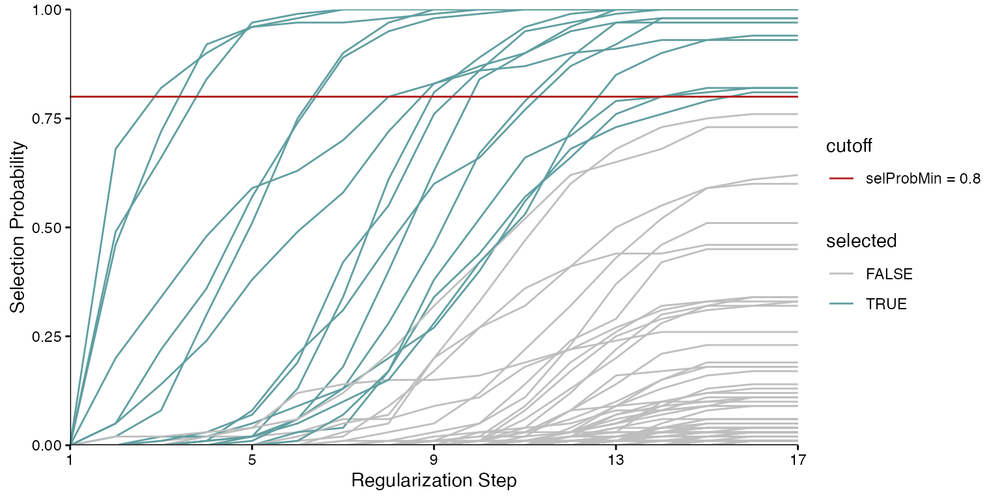
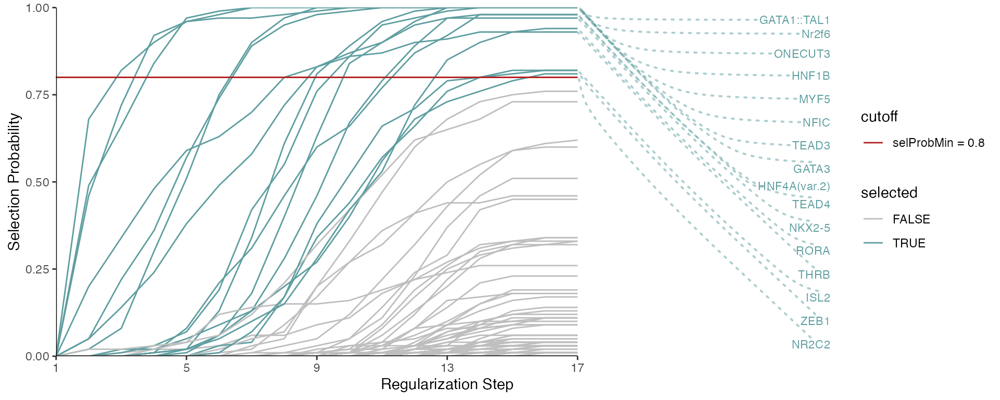
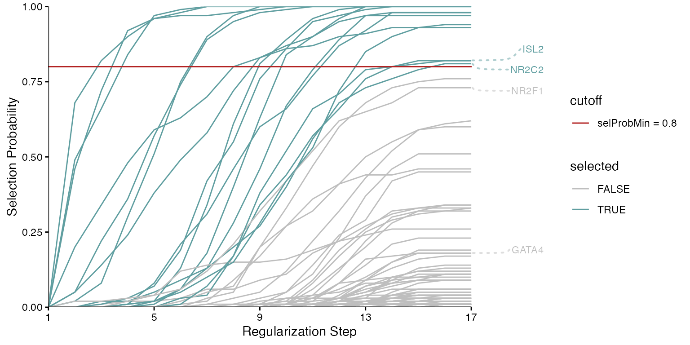
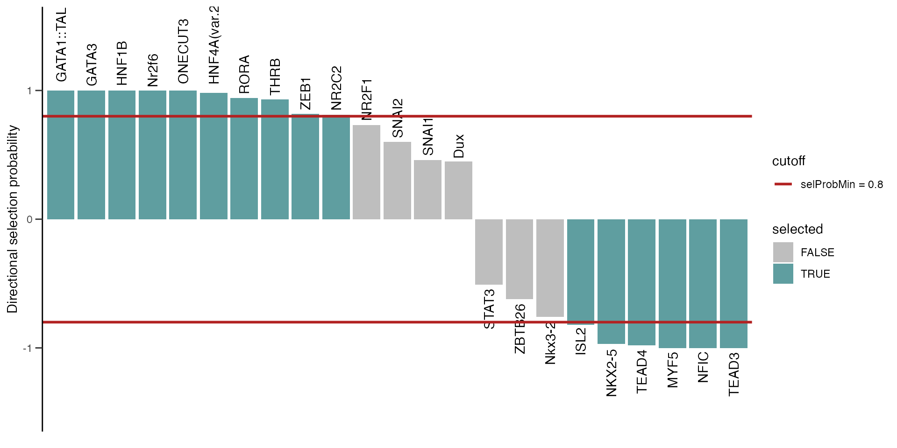
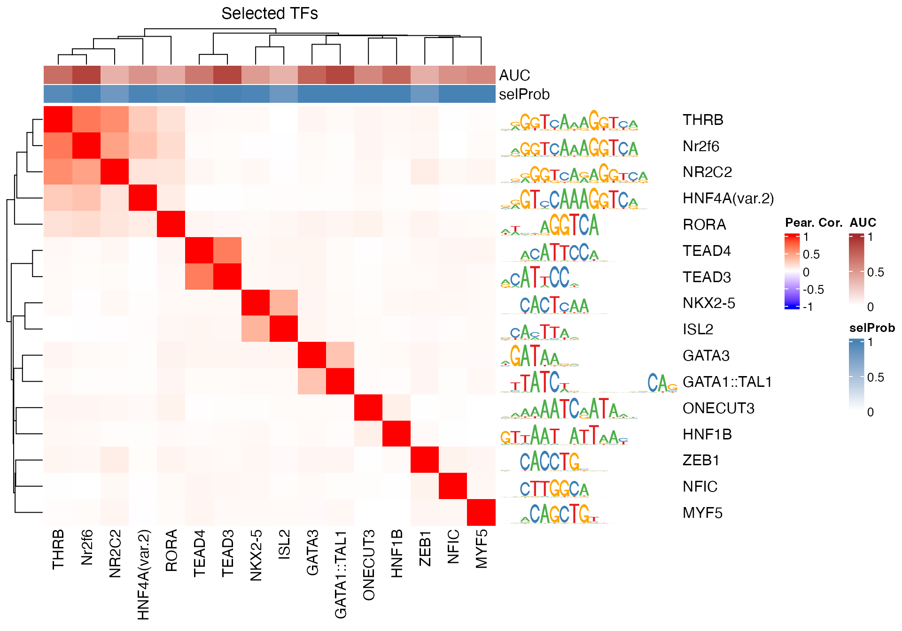

# Regression Based Approach for Motif Selection


## Introduction

Identifying important transcription factor (TF) motifs, as shown in [the
main
vignette](https://bioconductor.org/packages/3.23/monaLisa/vignettes/monaLisa.html),
could also be done using a regression-based approach, where motifs have
to compete against each other for selection. In this framework, the
response vector can be the observed experimental measure of interest,
e.g. log-fold changes of accessibility for a set of regions, and the
predictors consist of the TF motif hits across those regions. In
*[monaLisa](https://bioconductor.org/packages/3.23/monaLisa)*, we
implement the randomized lasso stability selection proposed by
Meinshausen and Bühlmann (2010) with the improved error bounds
introduced by Shah and Samworth (2013). We have modified the
[`stabs::glmnet.lasso`](https://rdrr.io/pkg/stabs/man/fitfuns.html)
function used by
[`stabs::stabsel`](https://rdrr.io/pkg/stabs/man/stabsel.html) from the
*[stabs](https://CRAN.R-project.org/package=stabs)* package to implement
the randomized lasso.

Lasso stability selection performs the lasso regression multiple times
on subsamples of the data, and returns a selection probability for each
predictor (number of times selected divided by number of regressions
done). With the randomized lasso, a weakness parameter is additionally
used to vary the lasso penalty term $\lambda$ to a randomly chosen value
between \[$\lambda$, $\lambda$/weakness\] for each predictor. This type
of regularization has advantages in cases where the number of predictors
exceeds the number of observations, in selecting variables consistently,
demonstrating better error control and not depending strongly on the
penalization parameter (Meinshausen and Bühlmann 2010).

With this approach, TF motifs compete against each other to explain the
response vector, and we can also include additional predictors like GC
content to compete against the TF motifs for selection. This is
especially useful if the response is biased by sequence composition, for
example if regions with higher GC content tend to have higher response
values.

It is worth noting that, as with any regression analysis, the
interpretability of the results depends strongly on the quality of the
predictors. Hence, increasing the size of the motif database is not, in
itself, a guarantee for more interpretable results, since the added
motifs may be unrelated to the signal of interest. In addition, as
discussed in section @ref(collinearity), a high level of redundancy,
resulting in strong correlations among the motifs, may result in more
ambiguous selection probabilities in the regression approach. In fact,
also for the binned approach, although the motifs are evaluated
independently for association with the outcome, a high degree of
redundancy can lead to large collections of very similar motifs showing
significant enrichments, complicating interpretability of the results.

## Motif selection with Randomized Lasso Stability Selection

In the example below, we select for TF motifs explaining log-fold
changes in chromatin accessibility (ATAC-seq) across the enhancers
between mouse liver and lung tissue at P0, but this can be applied to
other data types as well (ChIP-seq, RNA-seq, methylation etc.). Positive
log2-fold changes indicate more accessibility in the liver tissue,
whereas negative values indicate more accessibility in the lung tissue.

### Load packages

We start by loading the needed packages:

``` r
library(monaLisa)
library(JASPAR2020)
library(TFBSTools)
library(BSgenome.Mmusculus.UCSC.mm10)
library(Biostrings)
library(SummarizedExperiment)
library(ComplexHeatmap)
library(circlize)
library(ggrepel)
```

### Load dataset

In this example dataset from ENCODE (The ENCODE Project Consortium
2012), and available in
*[monaLisa](https://bioconductor.org/packages/3.23/monaLisa)*, we have
quantified ATAC-seq reads on enhancers in mouse P0 lung and liver
tissues. The log2-fold change (our response vector in this example) is
for liver vs lung chromatin accessibility. We are using a set of 10,000
randomly sampled enhancers to illustrate how randomized lasso stability
selection can be used to select TF motifs.

``` r
# load GRanges object with logFC and peaks
gr_path <- system.file("extdata", "atac_liver_vs_lung.rds", 
                       package = "monaLisa")
gr <- readRDS(gr_path)
```

### Get TFBS per motif and peak

We will now construct the transcription factor binding site (TFBS)
matrix for known motifs (from a database like
*[JASPAR2020](https://bioconductor.org/packages/3.23/JASPAR2020)*) in
the given peak regions. We use the `findMotifHits` function to scan for
TF motif hits. This matrix will be the predictor matrix in our
regression. This step may take a while, and it may be useful to
parallelize it using the `BPPARAM` argument (e.g. to run on `n` parallel
threads using the multi-core backend, you can use:
`findMotifHits(..., BPPARAM = BiocParallel::MulticoreParam(n))`).

As mentioned, this framework offers the flexibility to add additional
predictors to compete against the TF motifs for selection. Here, we add
the fraction of G+C and CpG observed/expected ratio as predictors, to
ensure that selected TF motifs are not just detecting a simple trend in
GC or CpG composition.

``` r
# get PFMs (vertebrate TFs from Jaspar)
pfms <- getMatrixSet(JASPAR2020, list(matrixtype = "PFM", 
                                      tax_group = "vertebrates"))

# randomly sample 300 PFMs for illustration purposes (for quick runtime)
set.seed(4563)
pfms <- pfms[sample(length(pfms), size = 300)]

# convert PFMs to PWMs
pwms <- toPWM(pfms)

# get TFBS on given GRanges (peaks)
# suppress warnings generated by matchPWM due to the presence of Ns 
# in the sequences
peakSeq <- getSeq(BSgenome.Mmusculus.UCSC.mm10, gr)
suppressWarnings({
  hits <- findMotifHits(query = pwms, subject = peakSeq, min.score = 10.0,
                        BPPARAM = BiocParallel::SerialParam())
})

# get TFBS matrix
TFBSmatrix <- unclass(table(factor(seqnames(hits), levels = seqlevels(hits)),
                            factor(hits$pwmname, levels = name(pwms))))
TFBSmatrix[1:6, 1:6]
#>              
#>               NR3C2 Arnt LHX1 SNAI1 MAFG ZSCAN4
#>   peak_51663      0    0    0     0    0      0
#>   peak_57870      0    0    0     0    0      0
#>   peak_2986       2    0    0     0    0      0
#>   peak_124022     0    0    0     0    0      0
#>   peak_29925      0    2    0     1    0      0
#>   peak_95246      0    0    0     0    0      0

# remove TF motifs with 0 binding sites in all regions
zero_TF <- colSums(TFBSmatrix) == 0
sum(zero_TF)
#> [1] 2
TFBSmatrix <- TFBSmatrix[, !zero_TF]

# calculate G+C and CpG obs/expected
fMono <- oligonucleotideFrequency(peakSeq, width = 1L, as.prob = TRUE)
fDi <- oligonucleotideFrequency(peakSeq, width = 2L, as.prob = TRUE)
fracGC <- fMono[, "G"] + fMono[, "C"]
oeCpG <- (fDi[, "CG"] + 0.01) / (fMono[, "G"] * fMono[, "C"] + 0.01)

# add GC and oeCpG to predictor matrix
TFBSmatrix <- cbind(fracGC, oeCpG, TFBSmatrix)
TFBSmatrix[1:6, 1:6]
#>                fracGC     oeCpG NR3C2 Arnt LHX1 SNAI1
#> peak_51663  0.5155709 0.4079115     0    0    0     0
#> peak_57870  0.4963235 0.3048298     0    0    0     0
#> peak_2986   0.4008264 0.3103806     2    0    0     0
#> peak_124022 0.4572650 0.4429813     0    0    0     0
#> peak_29925  0.4675000 0.3495939     0    2    0     1
#> peak_95246  0.5144509 0.4020976     0    0    0     0
```

#### A note on collinearity

At this point it is useful for the user to get an overall feeling of the
collinearity structure in the TFBS matrix. Motifs that share a lot of
similar binding sites across the peaks will be highly correlated. High
collinearity between predictors is a well known problem in linear
regression. It particularly manifests itself in the lasso regression for
example, where if variables are equally highly correlated with the
response, not all are co-selected as predictors (if they are signal
variables). Instead, one is arbitrarily chosen while the others’
coefficients are set to zero. The rationale is that the non-selected
correlated predictors do not provide much additional information to
explain the response. It is good to be aware of these properties of
regression, and to place more weight on the meaning of the selected
motif itself, rather than the specific TF name when interpreting the
results.

If many cases of high correlations exist and this is a concern, one may
consider selecting a representative set of predictors to use. This may
for example be achieved by clustering the weight matrices beforehand and
using only one representative motif per cluster for running the
regression, using tools such as for example RSAT (Castro-Mondragon et
al. 2017). RSAT-derived clusters of Jaspar weight matrices can be found
at <https://jaspar.genereg.net/matrix-clusters/vertebrates/>.

If the user is interested in working with all correlated motifs, the
binned approach is preferable as the motifs are independently tested for
significance (see the [binned enrichment
vignette](https://bioconductor.org/packages/3.23/monaLisa/vignettes/monaLisa.html)).
In the regression-based approach on the other hand, we can more clearly
understand the relative contributions of TF motifs to the response in
the context of each other.

### Identify important TFs

We can now run randomized lasso stability selection to identify TFs that
are likely to explain the log-fold changes in accessibility. The exact
choice of parameter values for this approach will depend largely on how
stringent the user wishes to be and how much signal there is in the
data. For example, for more stringent selections, one may decrease the
value of the `weakness` parameter which will make it harder for a
variable to get selected. The user is in control of false discoveries
with the `PFER` parameter, which indicates the number of falsely
selected variables. As for the selection probability cutoff, Meinshausen
and Bühlmann (2010) argue that values in the range of \[0.6, 0.9\]
should give similar results. See the `randLassoStabSel` function for
more details and default parameter values as well as the
[`stabs::stabsel`](https://rdrr.io/pkg/stabs/man/stabsel.html) function
for the default assumptions on the stability selection implementation by
Shah and Samworth (2013).

``` r
## randLassoStabSel() is stochastic, so if we run with parallelization
##   (`mc.cores` argument), we must select a random number generator that can
##   provide multiple streams of random numbers used in the `parallel` package
##   and set its seed for reproducible results
# RNGkind("L'Ecuyer-CMRG")
# set.seed(123)
# se <- randLassoStabSel(x = TFBSmatrix, y = gr$logFC_liver_vs_lung, 
#                        cutoff = 0.8, mc.preschedule = TRUE, 
#                        mc.set.seed = TRUE, mc.cores = 2L)

# if not running in parallel mode, it is enough to use set.seed() before 
#   the call to ensure reproducibility (`mc.sores = 1`)
set.seed(123)
se <- randLassoStabSel(x = TFBSmatrix, y = gr$logFC_liver_vs_lung, 
                       cutoff = 0.8)
se
#> class: SummarizedExperiment 
#> dim: 10000 300 
#> metadata(12): stabsel.params.cutoff stabsel.params.selected ...
#>   stabsel.params.call randStabsel.params.weakness
#> assays(1): x
#> rownames(10000): peak_51663 peak_57870 ... peak_98880 peak_67984
#> rowData names(1): y
#> colnames(300): fracGC oeCpG ... CLOCK OLIG2
#> colData names(20): selProb selected ... regStep16 regStep17

# selected TFs
colnames(se)[se$selected]
#>  [1] "NKX2-5"       "GATA1::TAL1"  "HNF1B"        "HNF4A(var.2)" "Nr2f6"       
#>  [6] "ONECUT3"      "MYF5"         "THRB"         "ISL2"         "NR2C2"       
#> [11] "TEAD3"        "TEAD4"        "GATA3"        "RORA"         "NFIC"        
#> [16] "ZEB1"
```

The stability paths visualize how predictors get selected over
decreasing regularization stringency (from left to right):

``` r
plotStabilityPaths(se)
```



Each line corresponds to a predictor, and we can see the selection
probabilities as a function of the regularization steps, corresponding
to decreasing values for the lambda regularization parameter in lasso.
The predictor (TF motif) selection happens at the last step, given the
specified minimum probability.

We can additionally show the labels of the predictors which were
selected. Note that if predictors have the same y-value at the last
regularization step, they are shown in a random order. To reproduce the
plot, you will need to set a seed.

``` r
set.seed(123)
plotStabilityPaths(se, labelPaths = TRUE)
```



Alternatively, we can visualize specific predictors, regardless of
whether or not they were selected.

``` r
set.seed(123)
plotStabilityPaths(se, labelPaths = TRUE, labelNudgeX = 3,
                   labels = c("ISL2", "NR2C2", "NR2F1", "GATA4"))
```



We can also visualize the selection probabilities of the selected TF
motifs, optionally multiplied by the sign of the correlation to the
response vector, to know how the TF relates to the change of
accessibility (`directional` parameter). In our example, positive
correlations to the response vector indicate a correlation with
enhancers more accessible in the liver, whereas negative ones indicate a
correlation with enhancers more accessible in the lung. Note that
although one can vary the `selProbMinPlot` argument which sets the
selection probability cutoff, it is best to re-run randomized lasso
stability selection with the new cutoff, as this influences other
parameter choices the model uses internally. See Meinshausen and
Bühlmann (2010) for more details.

``` r
plotSelectionProb(se, directional = TRUE, ylimext = 0.5)
```



Next, we visualize the correlation structure of the selected TF motifs
within the TFBS matrix. While the collinearity of predictors is a
general issue in regression-based approaches, randomized lasso stability
selection normally does better at co-selecting intermediately correlated
predictors. In practice, we see it select predictors with correlations
as high as 0.9. However, it is good to keep in mind that this can be an
issue, and that predictors that are highly correlated with each other
might not end up being co-selected (see section @ref(collinearity)).

``` r
# subset the selected TFs
sel <- colnames(se)[se$selected]
se_sub <- se[, sel]

# exclude oeCpG and fracGC
excl <- colnames(se_sub) %in% c("oeCpG", "fracGC")
se_sub <- se_sub[, !excl]

# correlation matrix 
TFBSmatrixCorSel <- cor(TFBSmatrix[, colnames(se_sub)], method = "pearson")

# heatmap
pfmsSel <- pfms[match(colnames(TFBSmatrixCorSel), name(pfms))]
maxwidth <- max(sapply(TFBSTools::Matrix(pfmsSel), ncol))
seqlogoGrobs <- lapply(pfmsSel, seqLogoGrob, xmax = maxwidth)

hmSeqlogo <- rowAnnotation(logo = annoSeqlogo(seqlogoGrobs, which = "row"),
                           annotation_width = unit(2, "inch"), 
                           show_annotation_name = FALSE
)

colAnn <- HeatmapAnnotation(AUC = se_sub$selAUC, selProb = se_sub$selProb,
                            show_legend = TRUE, 
                            show_annotation_name = TRUE,
                            col = list(
                              AUC = colorRamp2(c(0, 1), 
                                               c("white", "brown")),
                              selProb = colorRamp2(c(0, 1), 
                                                   c("white", "steelblue")))
)

Heatmap(TFBSmatrixCorSel, 
        show_row_names = TRUE, 
        show_column_names = TRUE, 
        name = "Pear. Cor.", column_title = "Selected TFs",
        col = colorRamp2(c(-1, 0, 1), c("blue", "white", "red")), 
        right_annotation = hmSeqlogo,
        top_annotation = colAnn)
```



 

We can examine the peaks that have hits for a selected TF motif of
interest, ordered by absolute accessibility changes.

``` r
TF <- sel[2]
TF
#> [1] "GATA1::TAL1"

i <- which(assay(se, "x")[, TF] > 0) # peaks that contain TF hits...
nm <- names(sort(abs(gr$logFC_liver_vs_lung[i]), 
                 decreasing = TRUE)) # ... order by |logFC|

gr[nm]
#> GRanges object with 1102 ranges and 1 metadata column:
#>               seqnames              ranges strand | logFC_liver_vs_lung
#>                  <Rle>           <IRanges>  <Rle> |           <numeric>
#>    peak_59642     chr8   80499941-80501128      * |             5.31505
#>    peak_58095     chr8   40658907-40659590      * |             5.13536
#>   peak_100144    chr14   69318236-69318909      * |             5.09810
#>    peak_98635    chr14   41124351-41126121      * |             5.07972
#>    peak_42826     chr6   29700952-29701570      * |             5.02324
#>           ...      ...                 ...    ... .                 ...
#>    peak_45104     chr6   84095148-84095495      * |        -0.020828315
#>    peak_16029     chr2 132269993-132270884      * |         0.007621169
#>    peak_55106     chr7 129526059-129526291      * |         0.004120784
#>    peak_97436    chr14   20873345-20873654      * |         0.000765027
#>    peak_67068     chr9   75050089-75050395      * |        -0.000217812
#>   -------
#>   seqinfo: 19 sequences from an unspecified genome; no seqlengths
```

## Session info and logo

The monaLisa logo uses a drawing that was obtained from
[http://vectorish.com/lisa-simpson.html](http://vectorish.com/lisa-simpson.md)
under the Creative Commons attribution - non-commercial 3.0 license:
<https://creativecommons.org/licenses/by-nc/3.0/>.

This vignette was built using:

``` r
sessionInfo()
#> R Under development (unstable) (2026-01-26 r89334)
#> Platform: aarch64-apple-darwin20
#> Running under: macOS Sequoia 15.7.3
#> 
#> Matrix products: default
#> BLAS:   /System/Library/Frameworks/Accelerate.framework/Versions/A/Frameworks/vecLib.framework/Versions/A/libBLAS.dylib 
#> LAPACK: /Library/Frameworks/R.framework/Versions/4.6-arm64/Resources/lib/libRlapack.dylib;  LAPACK version 3.12.1
#> 
#> locale:
#> [1] en_US.UTF-8/en_US.UTF-8/en_US.UTF-8/C/en_US.UTF-8/en_US.UTF-8
#> 
#> time zone: UTC
#> tzcode source: internal
#> 
#> attached base packages:
#> [1] grid      stats4    stats     graphics  grDevices utils     datasets 
#> [8] methods   base     
#> 
#> other attached packages:
#>  [1] ggrepel_0.9.6                      ggplot2_4.0.1                     
#>  [3] circlize_0.4.17                    ComplexHeatmap_2.27.0             
#>  [5] SummarizedExperiment_1.41.0        Biobase_2.71.0                    
#>  [7] MatrixGenerics_1.23.0              matrixStats_1.5.0                 
#>  [9] BSgenome.Mmusculus.UCSC.mm10_1.4.3 BSgenome_1.79.1                   
#> [11] rtracklayer_1.71.3                 BiocIO_1.21.0                     
#> [13] Biostrings_2.79.4                  XVector_0.51.0                    
#> [15] GenomicRanges_1.63.1               Seqinfo_1.1.0                     
#> [17] IRanges_2.45.0                     S4Vectors_0.49.0                  
#> [19] BiocGenerics_0.57.0                generics_0.1.4                    
#> [21] TFBSTools_1.49.0                   JASPAR2020_0.99.10                
#> [23] monaLisa_1.17.1                    BiocStyle_2.39.0                  
#> 
#> loaded via a namespace (and not attached):
#>  [1] DBI_1.2.3                   bitops_1.0-9               
#>  [3] stabs_0.6-4                 rlang_1.1.7                
#>  [5] magrittr_2.0.4              clue_0.3-66                
#>  [7] GetoptLong_1.1.0            compiler_4.6.0             
#>  [9] RSQLite_2.4.5               png_0.1-8                  
#> [11] systemfonts_1.3.1           vctrs_0.7.1                
#> [13] pwalign_1.7.0               pkgconfig_2.0.3            
#> [15] shape_1.4.6.1               crayon_1.5.3               
#> [17] fastmap_1.2.0               labeling_0.4.3             
#> [19] caTools_1.18.3              Rsamtools_2.27.0           
#> [21] rmarkdown_2.30              ragg_1.5.0                 
#> [23] DirichletMultinomial_1.53.0 purrr_1.2.1                
#> [25] bit_4.6.0                   xfun_0.56                  
#> [27] glmnet_4.1-10               cachem_1.1.0               
#> [29] cigarillo_1.1.0             jsonlite_2.0.0             
#> [31] blob_1.3.0                  DelayedArray_0.37.0        
#> [33] BiocParallel_1.45.0         parallel_4.6.0             
#> [35] cluster_2.1.8.1             R6_2.6.1                   
#> [37] bslib_0.10.0                RColorBrewer_1.1-3         
#> [39] jquerylib_0.1.4             Rcpp_1.1.1                 
#> [41] bookdown_0.46               iterators_1.0.14           
#> [43] knitr_1.51                  Matrix_1.7-4               
#> [45] splines_4.6.0               tidyselect_1.2.1           
#> [47] abind_1.4-8                 yaml_2.3.12                
#> [49] doParallel_1.0.17           codetools_0.2-20           
#> [51] curl_7.0.0                  lattice_0.22-7             
#> [53] tibble_3.3.1                withr_3.0.2                
#> [55] S7_0.2.1                    evaluate_1.0.5             
#> [57] desc_1.4.3                  survival_3.8-6             
#> [59] pillar_1.11.1               BiocManager_1.30.27        
#> [61] foreach_1.5.2               RCurl_1.98-1.17            
#> [63] scales_1.4.0                gtools_3.9.5               
#> [65] glue_1.8.0                  seqLogo_1.77.0             
#> [67] tools_4.6.0                 TFMPvalue_1.0.0            
#> [69] GenomicAlignments_1.47.0    fs_1.6.6                   
#> [71] XML_3.99-0.20               tidyr_1.3.2                
#> [73] colorspace_2.1-2            restfulr_0.0.16            
#> [75] cli_3.6.5                   textshaping_1.0.4          
#> [77] S4Arrays_1.11.1             dplyr_1.1.4                
#> [79] gtable_0.3.6                sass_0.4.10                
#> [81] digest_0.6.39               SparseArray_1.11.10        
#> [83] rjson_0.2.23                farver_2.1.2               
#> [85] memoise_2.0.1               htmltools_0.5.9            
#> [87] pkgdown_2.2.0.9000          lifecycle_1.0.5            
#> [89] httr_1.4.7                  GlobalOptions_0.1.3        
#> [91] bit64_4.6.0-1
```

## References

Castro-Mondragon, J. A., S. Jaeger, D. Thieffry, M. Thomas-Chollier, and
J. van Helden. 2017. “RSAT matrix-clustering: dynamic exploration and
redundancy reduction of transcription factor binding motif collections.”
*Nucleic Acids Res* 45 (13): e119. <https://doi.org/10.1093/nar/gkx314>.

Meinshausen, Nicolai, and Peter Bühlmann. 2010. “Stability Selection.”
*Journal of the Royal Statistical Society: Series B (Statistical
Methodology)* 72 (4): 417–73.
<https://doi.org/doi:10.1111/j.1467-9868.2010.00740.x>.

Shah, Rajen D., and Richard J. Samworth. 2013. “Variable Selection with
Error Control: Another Look at Stability Selection.” *Journal of the
Royal Statistical Society: Series B (Statistical Methodology)* 75 (1):
55–80. <https://doi.org/doi:10.1111/j.1467-9868.2011.01034.x>.

The ENCODE Project Consortium. 2012. “An Integrated Encyclopedia of DNA
Elements in the Human Genome.” *Nature* 489 (7414): 57–74.
