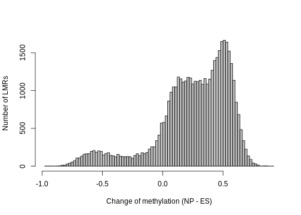
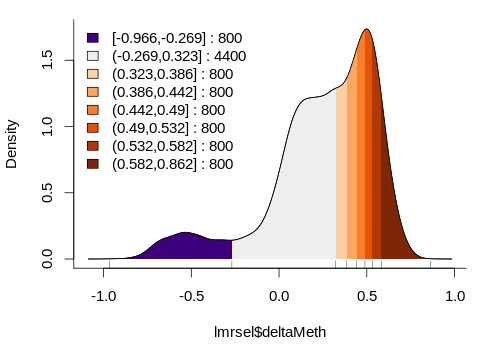
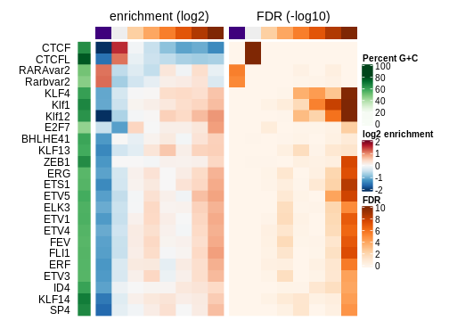
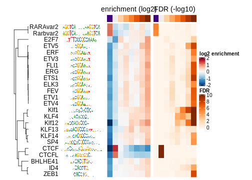
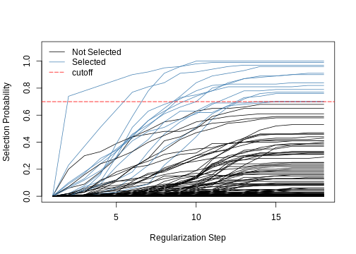
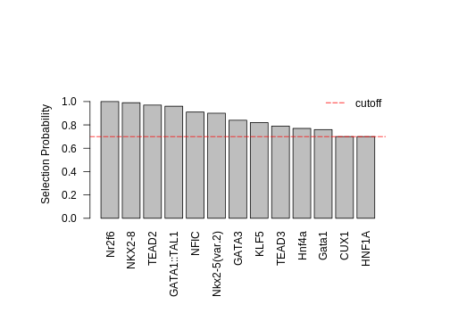
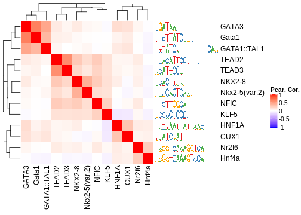

# Introduction

`monaLisa` is a collection of functions for working with biological sequences and motifs
that represent the binding preferences of transcription factors or nucleic acid binding proteins.

For example, `monaLisa` can make use of her father [Homer](http://homer.ucsd.edu/homer/index.html)
to look for enriched motifs in sets of genomic regions, compared to all other regions.

The motifs come from a collection of transcription factor binding site specificities,
such as `JASPAR2018`. The regions could be for example promoters, non-promoters (distal regions)
or accessible regions. The regions are grouped into bins according to a numerical value
assigned to each bin, such as change of expression or accessibility.

`monaLisa` can also be used to look for motifs in sequences.

Finally, `monaLisa` can can be used to predict what transcription factors are likely
to explain observed changes in chromatin accessibility between two conditions.


# Quick example: Identify enriched motifs


```r
# load package
library(monaLisa)

# bin regions
# (atac.peaks.change is a numerical vector)
bins <- bin(x = atac.peaks.change, binmode = "equalN", nElement = 400)

# dump motifs into file
dumpJaspar("jaspar2018.motif", pkg = "JASPAR2018")

# find Homer (findMotifsGenome.pl)
homerfile <- findHomer(dirs = "/path/to/look/into")

# run analysis
# (atac.peaks is a GRanges)
se <- runHomer(gr = atac.peaks, b = bins, genomedir = "/work/gbioinfo/DB/genomes/mm10",
               outdir = "myresults", motifFile = "jaspar2018.motif", homerfile = homerfile,
               regionsize = "given", Ncpu = 4L)

```

`se` is a `SummarizedExperiment` with `assays` *p*, *FDR*, *enr* and *log2enr*, each containing a matrix
with motifs (rows) by bins (columns). The values are:  

- *p*: the raw P value ($-\log_{10} p$) of a given motif enrichment in a given bin,
  as reported by Homer. Each P value results from a Homer analysis testing each
  motif occuring within the bin, compared to its occurrences in all other bins
  as a background.  
- *FDR*: Same as *p* but adjusted for multiple testing using the method of
  Benjamini and Hochberg, 1995 (`p.adjust(..., method="fdr"`).  
- *enr*: Motif enrichments, calculated as: $enr = (o - e) / \sqrt e$, where $o$ and
  $e$ are the observed and expected numbers of regions in the bin containing a
  given motif. These enrichments correspond to $z$ values ($z = (z - \mu)/\sigma$),
  assuming that the numbers of regions in a bin that contain a motif are independent
  Poisson random variables with mean and variance $e$.
- *log2enr*: Motif enrichments, calculated as: $log2enr = log2((o + 8)/(e + 8))$,
  where $o$ and $e$ are the observed and expected numbers of regions in the bin
  containing a given motif.

In addition, `rowData(se)` and `colData(se)` give information about the used motifs
and bins, respectively. In `metadata(se)` you can find information about parameter
values.

# Detailed example: Finding TFs enriched in differentially methylated regions

The detailed example is based on an in vitro differentiation system, in which
mouse embryonic stem (ES) cells are differentiated into neuronal progenitors (NP).
In an earlier study [@LMRs], we have analyzed the genome-wide CpG methylation patterns
in these cell types and identified so call *low methylated regions* (LMRs), that
have reduced methylation levels and correspond to regions bound by transcription
factors.

We have later published a tool that systematically identifies such regions from
genome-wide methylation data [@MethylSeekR]. Interestingly, a change in methylation
of LMRs is indicative of altered transcription factor binding. We will therefore
use these regions to identify TF motifs that are enriched/depleted in LMR regions
that change their methylation between ES and NP cell states.


## Load library
We start by loading the needed libraries:  

```r
library(GenomicRanges)
library(SummarizedExperiment)
library(monaLisa)
```

## Genomic regions of interest
`monaLisa` contains a file with genomic coordinates (mouse mm9 assembly) of LMRs,
with the respective changes of methylation:  

```r
lmrfile <- system.file("extdata", "LMRsESNPmerged.gr.rds", package = "monaLisa")
lmr <- readRDS(lmrfile)
lmr
#> GRanges object with 45425 ranges and 1 metadata column:
#>           seqnames          ranges strand |            deltaMeth
#>              <Rle>       <IRanges>  <Rle> |            <numeric>
#>       [1]     chr1 3539234-3540282      * |    0.319029850746269
#>       [2]     chr1 3670995-3672245      * |   0.0657351540171483
#>       [3]     chr1 3903396-3904604      * |    0.480331262939959
#>       [4]     chr1 3943581-3944238      * |    0.450472745732597
#>       [5]     chr1 4140538-4141648      * |    0.501476793248945
#>       ...      ...             ...    ... .                  ...
#>   [45421]     chrY 2887848-2888104      * |  -0.0200203816935335
#>   [45422]     chrY 2890206-2890704      * |   -0.102559934935554
#>   [45423]     chrY 2891592-2894150      * |  -0.0316682058319661
#>   [45424]     chrY 2895434-2896286      * |    0.130623048730827
#>   [45425]     chrY 2901734-2902491      * | 0.000494588304695176
#>   -------
#>   seqinfo: 35 sequences from an unspecified genome
```

You can see there are 45425 LMRs, most of which gain methylation between
ES and NP stages:  

```r
hist(lmr$deltaMeth, 100, col = "gray", main = "",
     xlab = "Change of methylation (NP - ES)", ylab = "Number of LMRs")
```



In order to keep the computation time reasonable, we'll select 10,000 of the LMRs randomly:  

```r
set.seed(1)
lmrsel <- lmr[ sample(x = length(lmr), size = 10000, replace = FALSE) ]
```


## Bin genomic regions
Now let's bin our LMRs by how much they change methylation, using the `bin` function.
We are not interested in small changes of methylation, say less than 0.3, so we'll
use the `minAbsX` argument to create a *no-change* bin in [-0.3, 0.3). The remaining
LMRs are put into bins of 800 each:  

```r
bins <- bin(x = lmrsel$deltaMeth, binmode = "equalN", nElement = 800, minAbsX = 0.3)
table(bins)
#> bins
#> [-0.966,-0.269]  (-0.269,0.323]   (0.323,0.386]   (0.386,0.442]    (0.442,0.49] 
#>             800            4400             800             800             800 
#>    (0.49,0.532]   (0.532,0.582]   (0.582,0.862] 
#>             800             800             800
```

<!--
saveRDS(bins, "/work/gbioinfo/stadler/development/R/compbio-lisa/inst/extdata/bins.rds")
-->

Because of the asymmetry of methylation changes, there is only a single bin with LMRs
that lost methylation and many that gained:  

```r
plotBinDensity(lmrsel$deltaMeth, bins, legend = "topleft")
```



Note that the bin-breaks around the *no-change* bin are not exactly -0.3 to 0.3.
They have been adjusted to have the required 800 LMRs per bin.

## Prepare motif enrichment analysis
Next we prepare the Homer-based motif enrichment analysis. We first need to create
a file with the motifs that we are interested in. A simple way is to dump the vertebrate
motifs from the `JASPAR2018` package into a file:  

```r
motiffile <- tempfile(fileext = ".motif")
dumpJaspar(motiffile, pkg = "JASPAR2018")
#> Loading required namespace: JASPAR2018
#> extracted 579 motifs from JASPAR2018
#> converting to HOMER format...done
#> [1] TRUE
```

Next we need to know where Homer is installed (you may have to adjust the `dirs`
argument below according to your environment):  

```r
homerfile <- findHomer(dirs = "/work/gbioinfo/Appz/Homer/Homer-4.10.4/bin/")
```

## Run motif enrichment analysis
Finally, we run the analysis. Again, you may have to adjust the `genomedir`.

This step requires that you have Homer installed on your system. Also, it may
take a while, for this reason you do not need to run it, but can just load the
results as shown below:  

```r
outdir <- tempfile(fileext = ".output")
se <- runHomer(gr = lmrsel, b = bins, genomedir = "/work/gbioinfo/DB/genomes/mm9",
               outdir = outdir, motifFile = motiffile, homerfile = homerfile,
               regionsize = "given", Ncpu = 20L)
```

<!--
saveRDS(se, "/work/gbioinfo/stadler/development/R/compbio-lisa/inst/extdata/se.rds")
-->

In case you did not run the above code, let's now read in the results:  

```r
se <- readRDS(system.file("extdata", "se.rds", package = "monaLisa"))
```

`se` is a `SummarizedExperiment` object which nicely keeps motifs, bins and
corresponding metadata together:  

```r
# summary
se
#> class: SummarizedExperiment 
#> dim: 579 8 
#> metadata(12): regions bins ... param.Ncpu motif.distances
#> assays(4): p FDR enr log2enr
#> rownames(579): Ahr.Arnt_P30561.P53762_SELEX
#>   Alx1_Q8C8B0_universalproteinbindingmicroarray ...
#>   ZNF740_Q8NDX6_HTSELEX ZSCAN4_Q8NAM6_HTSELEX
#> rowData names(3): motif.name motif.pfm motif.percentGC
#> colnames(8): [-0.966,-0.269] (-0.269,0.323] ... (0.532,0.582]
#>   (0.582,0.862]
#> colData names(4): bin.names bin.lower bin.upper bin.nochange
dim(se) # motifs-by-bins
#> [1] 579   8

# motif info
rowData(se)
#> DataFrame with 579 rows and 3 columns
#>                                                                                  motif.name
#>                                                                                 <character>
#> Ahr.Arnt_P30561.P53762_SELEX                                   Ahr.Arnt_P30561.P53762_SELEX
#> Alx1_Q8C8B0_universalproteinbindingmicroarray Alx1_Q8C8B0_universalproteinbindingmicroarray
#> ALX3_O95076_HTSELEX                                                     ALX3_O95076_HTSELEX
#> Alx4_O35137_universalproteinbindingmicroarray Alx4_O35137_universalproteinbindingmicroarray
#> Ar_P19091_HTSELEX                                                         Ar_P19091_HTSELEX
#> ...                                                                                     ...
#> ZNF384_Q8TF68_ChIPseq                                                 ZNF384_Q8TF68_ChIPseq
#> ZNF410_Q86VK4_HTSELEX                                                 ZNF410_Q86VK4_HTSELEX
#> Znf423_O08961_SELEX                                                     Znf423_O08961_SELEX
#> ZNF740_Q8NDX6_HTSELEX                                                 ZNF740_Q8NDX6_HTSELEX
#> ZSCAN4_Q8NAM6_HTSELEX                                                 ZSCAN4_Q8NAM6_HTSELEX
#>                                                                                                                                           motif.pfm
#>                                                                                                                                      <PFMatrixList>
#> Ahr.Arnt_P30561.P53762_SELEX                                                    Ahr.Arnt_P30561.P53762_SELEX; Ahr.Arnt_P30561.P53762_SELEX; Unknown
#> Alx1_Q8C8B0_universalproteinbindingmicroarray Alx1_Q8C8B0_universalproteinbindingmicroarray; Alx1_Q8C8B0_universalproteinbindingmicroarray; Unknown
#> ALX3_O95076_HTSELEX                                                                               ALX3_O95076_HTSELEX; ALX3_O95076_HTSELEX; Unknown
#> Alx4_O35137_universalproteinbindingmicroarray Alx4_O35137_universalproteinbindingmicroarray; Alx4_O35137_universalproteinbindingmicroarray; Unknown
#> Ar_P19091_HTSELEX                                                                                     Ar_P19091_HTSELEX; Ar_P19091_HTSELEX; Unknown
#> ...                                                                                                                                             ...
#> ZNF384_Q8TF68_ChIPseq                                                                         ZNF384_Q8TF68_ChIPseq; ZNF384_Q8TF68_ChIPseq; Unknown
#> ZNF410_Q86VK4_HTSELEX                                                                         ZNF410_Q86VK4_HTSELEX; ZNF410_Q86VK4_HTSELEX; Unknown
#> Znf423_O08961_SELEX                                                                               Znf423_O08961_SELEX; Znf423_O08961_SELEX; Unknown
#> ZNF740_Q8NDX6_HTSELEX                                                                         ZNF740_Q8NDX6_HTSELEX; ZNF740_Q8NDX6_HTSELEX; Unknown
#> ZSCAN4_Q8NAM6_HTSELEX                                                                         ZSCAN4_Q8NAM6_HTSELEX; ZSCAN4_Q8NAM6_HTSELEX; Unknown
#>                                                motif.percentGC
#>                                                      <numeric>
#> Ahr.Arnt_P30561.P53762_SELEX                  68.4297520661157
#> Alx1_Q8C8B0_universalproteinbindingmicroarray 33.9411764705882
#> ALX3_O95076_HTSELEX                           27.6723276723277
#> Alx4_O35137_universalproteinbindingmicroarray 35.4326074161271
#> Ar_P19091_HTSELEX                             52.0353982300885
#> ...                                                        ...
#> ZNF384_Q8TF68_ChIPseq                         15.3461217681401
#> ZNF410_Q86VK4_HTSELEX                         38.0728554641598
#> Znf423_O08961_SELEX                           65.8068783068783
#> ZNF740_Q8NDX6_HTSELEX                         81.2812812812813
#> ZSCAN4_Q8NAM6_HTSELEX                         47.6604278074866
head(rownames(se))
#> [1] "Ahr.Arnt_P30561.P53762_SELEX"                 
#> [2] "Alx1_Q8C8B0_universalproteinbindingmicroarray"
#> [3] "ALX3_O95076_HTSELEX"                          
#> [4] "Alx4_O35137_universalproteinbindingmicroarray"
#> [5] "Ar_P19091_HTSELEX"                            
#> [6] "Arid3a_Q62431_SELEX"

# bin info
colData(se)
#> DataFrame with 8 rows and 4 columns
#>                       bin.names          bin.lower          bin.upper
#>                     <character>          <numeric>          <numeric>
#> [-0.966,-0.269] [-0.966,-0.269]  -0.96551724137931 -0.268531468531469
#> (-0.269,0.323]   (-0.269,0.323] -0.268531468531469  0.323298977710742
#> (0.323,0.386]     (0.323,0.386]  0.323298977710742  0.386363636363636
#> (0.386,0.442]     (0.386,0.442]  0.386363636363636  0.441585177560474
#> (0.442,0.49]       (0.442,0.49]  0.441585177560474  0.489649122807018
#> (0.49,0.532]       (0.49,0.532]  0.489649122807018  0.531948324022346
#> (0.532,0.582]     (0.532,0.582]  0.531948324022346  0.581920903954802
#> (0.582,0.862]     (0.582,0.862]  0.581920903954802  0.862442922374429
#>                 bin.nochange
#>                    <logical>
#> [-0.966,-0.269]        FALSE
#> (-0.269,0.323]          TRUE
#> (0.323,0.386]          FALSE
#> (0.386,0.442]          FALSE
#> (0.442,0.49]           FALSE
#> (0.49,0.532]           FALSE
#> (0.532,0.582]          FALSE
#> (0.582,0.862]          FALSE
head(colnames(se))
#> [1] "[-0.966,-0.269]" "(-0.269,0.323]"  "(0.323,0.386]"   "(0.386,0.442]"  
#> [5] "(0.442,0.49]"    "(0.49,0.532]"

# assays: the motif enrichment results
assayNames(se)
#> [1] "p"       "FDR"     "enr"     "log2enr"
assay(se, "log2enr")[1:5, 1:3]
#>                                               [-0.966,-0.269] (-0.269,0.323]
#> Ahr.Arnt_P30561.P53762_SELEX                       0.00000000      0.0000000
#> Alx1_Q8C8B0_universalproteinbindingmicroarray      0.07855834     -0.2877679
#> ALX3_O95076_HTSELEX                               -0.06867203     -0.3094236
#> Alx4_O35137_universalproteinbindingmicroarray      0.14191570     -0.3153208
#> Ar_P19091_HTSELEX                                 -0.89110443     -0.1033845
#>                                               (0.323,0.386]
#> Ahr.Arnt_P30561.P53762_SELEX                     0.00000000
#> Alx1_Q8C8B0_universalproteinbindingmicroarray    0.22911758
#> ALX3_O95076_HTSELEX                              0.13301082
#> Alx4_O35137_universalproteinbindingmicroarray    0.08260004
#> Ar_P19091_HTSELEX                               -0.06326640
```

We can plot the results using the `plotMotifHeatmaps` function, e.g. selecting all factors that have an absolute log2 enrichment of at least 1.0 in any bin:  

```r
# select strongly enriched TFs
sel <- apply(assay(se, "log2enr"), 1, function(x) max(abs(x))) > 1.0
sum(sel)
#> [1] 24
seSel <- se[sel, ]
# shorten names
rownames(seSel) <- sub("\\_.*$","",rownames(seSel))
# plot
plotMotifHeatmaps(x = seSel, which.plots = c("log2enr","FDR"), width = 2.0,
                  cluster = TRUE, maxEnr = 2, maxSig = 10, show_motif_GC = TRUE)
```



As the Jaspar database contains many similar motifs, it is helpful to show the enrichment heatmap clustered by motif similarity. To this end, we first need to calculate all pairwise motif similarities (measured as maximum Pearson correlation of all possible shifted alignments). As this step may take a while, you can also skip this line of code and load the results using the next line of code. 


```r
SimMat <- motifSimilarity(rowData(se)$motif.pfm, Ncpu = 20L)
```

```r
SimMat <- readRDS(system.file("extdata", "SimMat.rds", package = "monaLisa"))
```
The order of the TFs in the resulting matrix is consistent with the elements of `se`

```r
all(rownames(SimMat) == rownames(se))
#> [1] TRUE
```
Using this matrix, we can create an *hclust* object for clustering and plot the clustered heatmap. The plotting of the dendogram is controlled by the parameter *show_dendrogram*. 

```r
# create hclust object, similarity defined by 1 - Pearson correlation
hcl <- hclust(as.dist(1 - SimMat[sel, sel]), method="average")
plotMotifHeatmaps(x = seSel, which.plots = c("log2enr","FDR"), width = 1.2,
                  cluster = hcl, maxEnr = 2, maxSig = 10,
                  show_dendrogram=TRUE, show_seqlogo = TRUE,
                  width.seqlogo = 1.2)
```




# Use `monaLisa` to annotate genomic regions with predicted motifs

As mentioned `monaLisa` can also be used to scan sequences for motifs. Here is an
example (just on few sequences/motifs for illustration):


```r
# get sequences of promoters as a DNAStringSet
# (could also be a single DNAString, or the name of a fasta file)
library(TxDb.Hsapiens.UCSC.hg19.knownGene)
#> Loading required package: GenomicFeatures
#> Loading required package: AnnotationDbi
gr <- promoters(TxDb.Hsapiens.UCSC.hg19.knownGene, upstream = 1000, downstream = 500)[c(1,4,5,10)]
#> Warning in valid.GenomicRanges.seqinfo(x, suggest.trim = TRUE): GRanges object contains 1 out-of-bound range located on sequence
#>   chrUn_gl000223. Note that ranges located on a sequence whose length is
#>   unknown (NA) or on a circular sequence are not considered out-of-bound
#>   (use seqlengths() and isCircular() to get the lengths and circularity
#>   flags of the underlying sequences). You can use trim() to trim these
#>   ranges. See ?`trim,GenomicRanges-method` for more information.
library(BSgenome.Hsapiens.UCSC.hg19)
#> Loading required package: BSgenome
#> Loading required package: Biostrings
#> Loading required package: XVector
#> 
#> Attaching package: 'Biostrings'
#> The following object is masked from 'package:base':
#> 
#>     strsplit
#> Loading required package: rtracklayer
seqs <- getSeq(BSgenome.Hsapiens.UCSC.hg19, gr)
seqs
#>   A DNAStringSet instance of length 4
#>     width seq                                               names               
#> [1]  1500 ACACATGCTACCGCGTCCAGGGG...CAGCCGGCTGGAGGGAGGGGCTC uc001aaa.3
#> [2]  1500 GCTATTATCACCTATATTTTCCA...CTCTTCTGTGGTCCCAATGAGGT uc001aal.1
#> [3]  1500 ACATGCATGTCACCCATGCCCAG...AGAAGAACTTTTAGTATGTACAT uc001aaq.2
#> [4]  1500 TTGGCTCAACTCCTGCCCAGCTC...CTCTTTCGGCCCAGCCCAGCTCA uc021oei.1

# get motifs as a PWMatrixList
# (could also be a single PWMatrix, or the name of a motif file)
library(JASPAR2018)
library(TFBSTools)
#> 
#> Attaching package: 'TFBSTools'
#> The following object is masked from 'package:DelayedArray':
#> 
#>     matrixClass
pwms <- getMatrixSet(JASPAR2018, list(matrixtype = "PWM", tax_group = "vertebrates"))
pwms <- pwms[c("MA0885.1","MA0099.3","MA0033.2","MA0037.3","MA0158.1")]
pwms
#> PWMatrixList of length 5
#> names(5): MA0885.1 MA0099.3 MA0033.2 MA0037.3 MA0158.1

# predict hits in sequences
res <- findMotifHits(query = pwms, subject = seqs, min.score = 6.0, method = "matchPWM")
res
#> GRanges object with 81 ranges and 3 metadata columns:
#>          seqnames    ranges strand |     matchedSeq  pwmname            score
#>             <Rle> <IRanges>  <Rle> | <DNAStringSet>    <Rle>        <numeric>
#>    [1] uc001aaa.3   268-275      + |       CAGTAATC    HOXA5 7.61262482998558
#>    [2] uc001aaa.3   673-679      + |        ATAAATA    FOXL1 10.1984988427936
#>    [3] uc001aaa.3   696-703      + |       TGATTACC    GATA3  6.1684587372829
#>    [4] uc001aaa.3   908-915      + |       CGCAAATT    HOXA5 9.98185863965131
#>    [5] uc001aaa.3   315-322      - |       CTGTAGTG    HOXA5 6.51393556012037
#>    ...        ...       ...    ... .            ...      ...              ...
#>   [77] uc021oei.1   457-466      + |     TTGCCTCACC FOS::JUN 6.57112302780741
#>   [78] uc021oei.1   554-563      + |     TTGCCTCACA FOS::JUN 6.05218466241624
#>   [79] uc021oei.1   939-946      + |       CTTAAGTT    HOXA5 6.20581326475804
#>   [80] uc021oei.1   262-268      - |        ATCAACA    FOXL1 9.08701849590746
#>   [81] uc021oei.1   868-874      - |        GCAAACA    FOXL1 8.84243528727947
#>   -------
#>   seqinfo: 4 sequences from an unspecified genome

# ... or using method = "homer2"
homerfile <- findHomer(homerfile = "homer2", dirs = "/work/gbioinfo/Appz/Homer/Homer-4.10.4/bin/")
if (!is.na(homerfile)) {
    # use homer2 if available
    res2 <- findMotifHits(query = pwms, subject = seqs, min.score = 6.0, method = "homer2", homerfile = homerfile)
} else {
    # otherwise, use matchPWM
    res2 <- findMotifHits(query = pwms, subject = seqs, min.score = 6.0, method = "matchPWM")
}
res2
#> GRanges object with 81 ranges and 3 metadata columns:
#>          seqnames    ranges strand |     matchedSeq  pwmname            score
#>             <Rle> <IRanges>  <Rle> | <DNAStringSet>    <Rle>        <numeric>
#>    [1] uc001aaa.3   268-275      + |       CAGTAATC    HOXA5 7.61262419871253
#>    [2] uc001aaa.3   673-679      + |        ATAAATA    FOXL1 10.1984992484416
#>    [3] uc001aaa.3   696-703      + |       TGATTACC    GATA3  6.1684590515769
#>    [4] uc001aaa.3   908-915      + |       CGCAAATT    HOXA5 9.98185839032153
#>    [5] uc001aaa.3   315-322      - |       CACTACAG    HOXA5 6.51393546223841
#>    ...        ...       ...    ... .            ...      ...              ...
#>   [77] uc021oei.1   457-466      + |     TTGCCTCACC FOS::JUN 6.57112245096421
#>   [78] uc021oei.1   554-563      + |     TTGCCTCACA FOS::JUN 6.05218504475645
#>   [79] uc021oei.1   939-946      + |       CTTAAGTT    HOXA5 6.20581331157559
#>   [80] uc021oei.1   262-268      - |        TGTTGAT    FOXL1  9.0870181350399
#>   [81] uc021oei.1   868-874      - |        TGTTTGC    FOXL1 8.84243515936791
#>   -------
#>   seqinfo: 4 sequences from an unspecified genome

summary(res %in% res2)
#>    Mode    TRUE 
#> logical      81

# create hit matrix:
# number of site of each motif per sequence
m <- table(seqnames(res), as.character(res$pwmname))
m
#>             
#>              Dlx2 FOS::JUN FOXL1 GATA3 HOXA5
#>   uc001aaa.3    1        0     4     1     4
#>   uc001aal.1    8        2     5    10    11
#>   uc001aaq.2    5        8     3     1    10
#>   uc021oei.1    0        5     2     0     1
```


# Selecting Transcription Factors Likely to Explain Changes in Chromatin Accessibility Using Stability Selection

Randomized Lasso stability selection proposed by Meinshausen and Bühlmann [@StabSel] applies the lasso regression on several subsamples of the data using a weakness parameter that adds additional variation to the lambda parameter and allows for more correlated variables to be selected together. Although the main appeal of stability selection is that it allows for selection of predictors when the number of predictors exceeds the number of observations, the authors also argue for this as a way of slightly overcoming the problem of lasso only selecting variables that are not correlated, and performing better in a noisy dataset depending on how strongly one sets the weakness parameter. Shah and Samworth [@compStabs] have further improved error control for stability selection using complementary pairs stability selection. The R `stabs` package [@stabs] implements the Shah and Samworth version of stability selection. `monaLisa` uses a modified version of the `stabsel` function in `stabs` that performs randomized lasso stability selection.

Here we demonstrate the use of randomized lasso stability selection to select transcription factors (TFs) that are likely to explain changes in chromatin accessibility from ATAC-seq data. One can also use stability selection on any other type of data like ChIP-seq of specific histone marks for example. We are given a vector of log-fold changes (logFC) in chromatin accessibility between two conditions that we consider to be our response vector. The predictor matrix will consist of the number of transcription factor binding sites (TFBS) that each TF has across the peaks. The example data set comes from ENCODE [@encode] and consists of bam files for ATAC-seq from mouse postnatal (P0) liver (identifiers: ENCFF146ZCO, ENCFF109LQF) and lung (identifiers: ENCFF203DOC, ENCFF823PTD) tissues. Each condition had 2 replicates, and the peak calling was done per condition using MACS2 [@macs]. The peaks from both conditions were merged and used to calculate ATAC-seq counts for all samples with QuasR [@QuasR]. Counts per million (CPM) were calculated per sample and averaged across replicates. The logFC was calculated as [log2(CPM(Liver)+8) - log2(CPM(Lung)+8)].

Only distal autosomal peaks (distance > 1kb from any TSS) were kept since promoter peaks tend not to change so much in accessibility, and we are interested in selecting TFs that likely explain logFC in enhancer regions. The `.rds` files used in monaLisa's example dataset consist of peaks that had an absolute logFC greater than 2 and less than 2.2. This was done to reduce the number of peaks and speed up runtime to demonstrate the functions used in `monaLisa` that apply randomized lasso stability selection [@StabSel].


## Load Data


```r

library(monaLisa)

# Path to extdata 
peaks_path <- system.file("extdata", "Liver_vs_Lung_ATAC_peaks.rds", package = "monaLisa")
response_path <- system.file("extdata", "Liver_vs_Lung_ATAC_logFC.rds", package = "monaLisa")

# Load response vector and peaks GRanges
response <- readRDS(response_path)
peaks <- readRDS(peaks_path)
```

## Get predictor matrix showing number of TFBS per motif across the peaks

The `findMotifHits` function can be used to get the predicted binding sites of each transcription factor across a given set of genomic regions, 
which in our case is the ATAC-seq peaks. A predictor matrix which contains the number of TFBS each TF has across the given set of peaks is subsequently generated. Note that peaks that have 0 TFBS with all TFs will not be present in the resulting matrix. One can also make use of phylogenetic information of TFs and incorporate that in the predictor matrix. With ATAC-seq, we didn't want to restrict ourselves to conserved motif sequences. One can also add any additional property of the genomic regions in the response vector to compete against the TFs for selection. We added GC content and the ratio of observed-over-expected CpG (oeCpG) content.


```r

library(JASPAR2018)
library(TFBSTools)
library("BSgenome.Mmusculus.UCSC.mm10")
library(Biostrings)

# Genome
genome <- BSgenome.Mmusculus.UCSC.mm10

# Get PWMs
pfms <- getMatrixSet(JASPAR2018, list(matrixtype = "PFM", tax_group = "vertebrates")) # for seq-logos
pwms <- toPWM(pfms) # for searching

# Get TFBS on given GRanges
homerfile <- findHomer(homerfile = "homer2", dirs = "/work/gbioinfo/Appz/Homer/Homer-4.10.4/bin/")
if (!is.na(homerfile)) {
    # use homer2 if available
    hits <- findMotifHits(query = pwms, subject = peaks, min.score = 6.0, method = "homer2",
                          homerfile = homerfile, genome = genome, Ncpu = 2)
} else {
    # otherwise, use matchPWM
    hits <- findMotifHits(query = pwms, subject = peaks, min.score = 6.0, method = "matchPWM",
                          genome = genome)
}

# Get predictor matrix
predictor_matrix <- as.matrix(as.data.frame.matrix(table(seqnames(hits), as.character(hits$pwmname))))
predictor_matrix[1:6, 1:6]
#>          Ahr::Arnt Alx1 ALX3 Alx4 Ar Arid3a
#> peak_42          4    0    8    0  0      5
#> peak_103         0    2    1    2  0      1
#> peak_107         1    1    4    1  0      8
#> peak_121         0    0    3    0  0      6
#> peak_280        11    0    6    0  0      4
#> peak_289        12    3    9    2  0      5

# remove peaks that do not have any hits (also from the response vector) 
# and check all peaks in predictor_matrix are in same order as in the 
# peaks variable
w <- names(peaks)[!(names(peaks)%in%rownames(predictor_matrix))]
if(length(w)>0){
  peaks <- peaks[-w]
  response <- response[-w]
}
all(rownames(predictor_matrix)==names(peaks))
#> [1] TRUE
all(rownames(predictor_matrix)==names(response))
#> [1] TRUE

# Note that in this case all peaks have at least one TFBS for any of the TFs. 
# However, that may not always be the case. If a given set of peaks does 
# not appear in the hits variable one must be careful and remove the missing 
# peaks from the peaks variable before doing the GC content calculations below.

# calculate GC and oeCpG content
peakSeq <- BSgenome::getSeq(genome, peaks)
fMono <- oligonucleotideFrequency(peakSeq, width = 1L, as.prob = TRUE)
fDi <- oligonucleotideFrequency(peakSeq, width = 2L, as.prob = TRUE)
percGC <- fMono[,"G"] + fMono[,"C"]
oeCpG <- (fDi[,"CG"] + 0.01) / (fMono[,"G"] * fMono[,"C"] + 0.01)

# add GC and oeCpG to predictor matrix
predictor_matrix <- cbind(percGC, predictor_matrix)
predictor_matrix <- cbind(oeCpG, predictor_matrix)
predictor_matrix[1:6, 1:6]
#>              oeCpG    percGC Ahr::Arnt Alx1 ALX3 Alx4
#> peak_42  0.4089063 0.4304245         4    0    8    0
#> peak_103 0.2356167 0.4697509         0    2    1    2
#> peak_107 0.3329385 0.3970276         1    1    4    1
#> peak_121 0.3789488 0.4207317         0    0    3    0
#> peak_280 0.3728919 0.4653216        11    0    6    0
#> peak_289 0.4652580 0.4586751        12    3    9    2
```


## Run randomized lasso stability selection

We can now run randomized lasso stability selection to select TFs that are likely to explain the log-fold changes in accessibility (response vector). We can appreciate that some selected TFs are correlated to each other and were chosen toegther to explain the observed changes in accessibility.


```r
library(ComplexHeatmap) # heatmap drawing
#> Loading required package: grid
#> ========================================
#> ComplexHeatmap version 2.2.0
#> Bioconductor page: http://bioconductor.org/packages/ComplexHeatmap/
#> Github page: https://github.com/jokergoo/ComplexHeatmap
#> Documentation: http://jokergoo.github.io/ComplexHeatmap-reference
#> 
#> If you use it in published research, please cite:
#> Gu, Z. Complex heatmaps reveal patterns and correlations in multidimensional 
#>   genomic data. Bioinformatics 2016.
#> ========================================
library(circlize) # used for color specification
#> ========================================
#> circlize version 0.4.8
#> CRAN page: https://cran.r-project.org/package=circlize
#> Github page: https://github.com/jokergoo/circlize
#> Documentation: http://jokergoo.github.io/circlize_book/book/
#> 
#> If you use it in published research, please cite:
#> Gu, Z. circlize implements and enhances circular visualization 
#>   in R. Bioinformatics 2014.
#> ========================================

stabs <- randomized_stabsel(x = predictor_matrix, y = response,
                            weakness = 0.8, cutoff = 0.7, PFER = 2, mc.cores = 2)

# plot stability paths ...
plotStabilityPaths(stabs)
```



```r

# ... and selection probabilities
par(mfrow = c(1,1), mar = c(5,4,4,2) + 3)
plotSelectionProb(stabs)
```



```r

# plot correlation on TFBS matrix of selected TFs
# ... select predictors for selected TFs and calculate correlation
sel_matrix <- predictor_matrix[, stabs$selected]
sel_cor <- cor(sel_matrix, method = "pearson")

# ... prepare sequence logos
pfmsSel <- pfms[match(rownames(sel_cor), name(pfms))]
maxwidth <- max(sapply(Matrix(pfmsSel), ncol))
seqlogoGrobs <- lapply(pfmsSel, seqLogoGrob, xmax = maxwidth)
hmSeqlogo <- rowAnnotation(logo = anno_seqlogo(seqlogoGrobs, which = "row"),
                           annotation_width = unit(1.5, "inch"),
                           show_legend = FALSE, show_annotation_name = FALSE)

# ... draw heatmap
Heatmap(matrix = sel_cor, name = "Pear. Cor.",
        col = colorRamp2(c(-1, 0, 1), c("blue", "white", "red")),
        right_annotation = hmSeqlogo)
```




# Session info and logo
The monaLisa logo uses a drawing that was obtained from http://vectorish.com/lisa-simpson.html
under the Creative Commons attribution - non-commercial 3.0 license: https://creativecommons.org/licenses/by-nc/3.0/.

This vignette was built using:  

```r
sessionInfo(package = "monaLisa")
#> R version 3.6.1 (2019-07-05)
#> Platform: x86_64-pc-linux-gnu (64-bit)
#> Running under: CentOS Linux 7 (Core)
#> 
#> Matrix products: default
#> BLAS/LAPACK: /tungstenfs/groups/gbioinfo/Appz/easybuild/software/OpenBLAS/0.3.7-GCC-8.3.0/lib/libopenblas_skylakex-r0.3.7.so
#> 
#> locale:
#>  [1] LC_CTYPE=en_US.UTF-8       LC_NUMERIC=C              
#>  [3] LC_TIME=en_US.UTF-8        LC_COLLATE=en_US.UTF-8    
#>  [5] LC_MONETARY=en_US.UTF-8    LC_MESSAGES=en_US.UTF-8   
#>  [7] LC_PAPER=en_US.UTF-8       LC_NAME=C                 
#>  [9] LC_ADDRESS=C               LC_TELEPHONE=C            
#> [11] LC_MEASUREMENT=en_US.UTF-8 LC_IDENTIFICATION=C       
#> 
#> attached base packages:
#> character(0)
#> 
#> other attached packages:
#> [1] monaLisa_0.1.27
#> 
#> loaded via a namespace (and not attached):
#>   [1] VGAM_1.1-2                             
#>   [2] colorspace_1.4-1                       
#>   [3] rjson_0.2.20                           
#>   [4] ellipsis_0.3.0                         
#>   [5] BSgenome.Mmusculus.UCSC.mm10_1.4.0     
#>   [6] rprojroot_1.3-2                        
#>   [7] circlize_0.4.8                         
#>   [8] XVector_0.26.0                         
#>   [9] GenomicRanges_1.38.0                   
#>  [10] GlobalOptions_0.1.1                    
#>  [11] fs_1.3.1                               
#>  [12] clue_0.3-57                            
#>  [13] rstudioapi_0.10                        
#>  [14] roxygen2_7.0.1                         
#>  [15] stats_3.6.1                            
#>  [16] remotes_2.1.0                          
#>  [17] bit64_0.9-7                            
#>  [18] AnnotationDbi_1.48.0                   
#>  [19] xml2_1.2.2                             
#>  [20] codetools_0.2-16                       
#>  [21] splines_3.6.1                          
#>  [22] R.methodsS3_1.7.1                      
#>  [23] knitr_1.26                             
#>  [24] pkgload_1.0.2                          
#>  [25] zeallot_0.1.0                          
#>  [26] Rsamtools_2.2.1                        
#>  [27] seqLogo_1.52.0                         
#>  [28] annotate_1.64.0                        
#>  [29] base_3.6.1                             
#>  [30] dbplyr_1.4.2                           
#>  [31] cluster_2.1.0                          
#>  [32] GO.db_3.10.0                           
#>  [33] png_0.1-7                              
#>  [34] R.oo_1.23.0                            
#>  [35] readr_1.3.1                            
#>  [36] compiler_3.6.1                         
#>  [37] httr_1.4.1                             
#>  [38] backports_1.1.5                        
#>  [39] assertthat_0.2.1                       
#>  [40] Matrix_1.2-17                          
#>  [41] lazyeval_0.2.2                         
#>  [42] TxDb.Hsapiens.UCSC.hg19.knownGene_3.2.2
#>  [43] cli_1.1.0                              
#>  [44] prettyunits_1.0.2                      
#>  [45] tools_3.6.1                            
#>  [46] gtable_0.3.0                           
#>  [47] glue_1.3.1                             
#>  [48] TFMPvalue_0.0.8                        
#>  [49] GenomeInfoDbData_1.2.2                 
#>  [50] reshape2_1.4.3                         
#>  [51] dplyr_0.8.3                            
#>  [52] rappdirs_0.3.1                         
#>  [53] grDevices_3.6.1                        
#>  [54] Rcpp_1.0.3                             
#>  [55] Biobase_2.46.0                         
#>  [56] vctrs_0.2.0                            
#>  [57] Biostrings_2.54.0                      
#>  [58] rtracklayer_1.46.0                     
#>  [59] iterators_1.0.12                       
#>  [60] xfun_0.11                              
#>  [61] CNEr_1.22.0                            
#>  [62] stringr_1.4.0                          
#>  [63] ps_1.3.0                               
#>  [64] testthat_2.3.0                         
#>  [65] lifecycle_0.1.0                        
#>  [66] poweRlaw_0.70.2                        
#>  [67] gtools_3.8.1                           
#>  [68] devtools_2.2.1                         
#>  [69] XML_3.98-1.20                          
#>  [70] zlibbioc_1.32.0                        
#>  [71] scales_1.1.0                           
#>  [72] JASPAR2018_1.1.1                       
#>  [73] BSgenome_1.54.0                        
#>  [74] graphics_3.6.1                         
#>  [75] hms_0.5.2                              
#>  [76] parallel_3.6.1                         
#>  [77] SummarizedExperiment_1.16.0            
#>  [78] RColorBrewer_1.1-2                     
#>  [79] utils_3.6.1                            
#>  [80] curl_4.2                               
#>  [81] ComplexHeatmap_2.2.0                   
#>  [82] memoise_1.1.0                          
#>  [83] gridExtra_2.3                          
#>  [84] ggplot2_3.2.1                          
#>  [85] stabs_0.6-3                            
#>  [86] datasets_3.6.1                         
#>  [87] biomaRt_2.42.0                         
#>  [88] stringi_1.4.3                          
#>  [89] RSQLite_2.1.2                          
#>  [90] highr_0.8                              
#>  [91] S4Vectors_0.24.0                       
#>  [92] desc_1.2.0                             
#>  [93] foreach_1.4.7                          
#>  [94] GenomicFeatures_1.38.0                 
#>  [95] caTools_1.17.1.2                       
#>  [96] BiocGenerics_0.32.0                    
#>  [97] pkgbuild_1.0.6                         
#>  [98] BiocParallel_1.20.0                    
#>  [99] shape_1.4.4                            
#> [100] GenomeInfoDb_1.22.0                    
#> [101] rlang_0.4.2                            
#> [102] pkgconfig_2.0.3                        
#> [103] matrixStats_0.55.0                     
#> [104] bitops_1.0-6                           
#> [105] evaluate_0.14                          
#> [106] lattice_0.20-38                        
#> [107] purrr_0.3.3                            
#> [108] GenomicAlignments_1.22.1               
#> [109] bit_1.1-14                             
#> [110] processx_3.4.1                         
#> [111] tidyselect_0.2.5                       
#> [112] BSgenome.Hsapiens.UCSC.hg19_1.4.0      
#> [113] plyr_1.8.4                             
#> [114] magrittr_1.5                           
#> [115] R6_2.4.1                               
#> [116] IRanges_2.20.1                         
#> [117] DelayedArray_0.12.0                    
#> [118] DBI_1.0.0                              
#> [119] pillar_1.4.2                           
#> [120] withr_2.1.2                            
#> [121] KEGGREST_1.26.1                        
#> [122] RCurl_1.95-4.12                        
#> [123] tibble_2.1.3                           
#> [124] crayon_1.3.4                           
#> [125] BiocFileCache_1.10.2                   
#> [126] progress_1.2.2                         
#> [127] GetoptLong_0.1.7                       
#> [128] TFBSTools_1.24.0                       
#> [129] usethis_1.5.1                          
#> [130] grid_3.6.1                             
#> [131] blob_1.2.0                             
#> [132] callr_3.3.2                            
#> [133] methods_3.6.1                          
#> [134] digest_0.6.23                          
#> [135] xtable_1.8-4                           
#> [136] R.utils_2.9.0                          
#> [137] openssl_1.4.1                          
#> [138] stats4_3.6.1                           
#> [139] munsell_0.5.0                          
#> [140] glmnet_3.0-1                           
#> [141] DirichletMultinomial_1.28.0            
#> [142] askpass_1.1                            
#> [143] sessioninfo_1.1.1
```

# References
